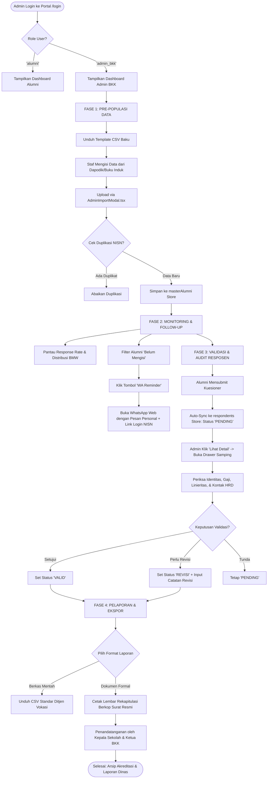

# Workflow & Dokumentasi Teknis: Panel Administrator BKK
## Sistem Informasi Alumni & Tracer Study SMK Sasmita Jaya 2

Dokumen ini menjelaskan secara komprehensif seluruh alur kerja (*workflow*), arsitektur komponen, struktur data, diagram alir (*flowcharts*), serta prosedur operasional standar (SOP) dari modul **Dashboard Administrator BKK (Bursa Kerja Khusus)** pada sistem Tracer Study SMK Sasmita Jaya 2 Pamulang.

---

## 1. Ringkasan Eksekutif & Struktur Berkas

Panel Administrator BKK dirancang untuk kebutuhan **monitoring skala besar, validasi data responden kuesioner, follow-up alumni, serta pelaporan resmi keterserapan lulusan (BMW)** ke pihak Yayasan Sasmita Jaya, Dinas Pendidikan, dan Direktorat Jenderal Pendidikan Vokasi Kemendikbudristek RI.

```
┌─────────────────────────────────────────────────────────────────────────────────────────┐
│                           PANEL ADMINISTRATOR BKK                                       │
├───────────────────┬───────────────────┬───────────────────┬─────────────────────────────┤
│ 1. Monitoring     │ 2. Master Data    │ 3. Verifikasi     │ 4. Pelaporan Resmi          │
│ • Response Rate   │ • Import Dapodik  │ • Audit Jawaban   │ • Export Ditjen Vokasi      │
│ • Target Kuota    │ • Pre-populate    │ • Detail Drawer   │ • Cetak Rekap PDF (Kop SK)  │
│ • Distribusi BMW  │ • WA Blast / Rem. │ • Validasi Status │ • Tanda Tangan Kepsek & BKK │
└───────────────────┴───────────────────┴───────────────────┴─────────────────────────────┘
```

### 1.1 Berkas Sumber Kode Terkait (File Structure)

| Modul / Komponen | Path Berkas | Fungsi Utama |
| :--- | :--- | :--- |
| **State Management** | [`src/store/adminStore.ts`](file:///c:/Arif/projek%20coding/web_alumni/src/store/adminStore.ts) | Store Zustand persistent (`tracer_study_admin_sasmita2`) |
| **Routing & Aliases** | [`src/App.tsx`](file:///c:/Arif/projek%20coding/web_alumni/src/App.tsx) | Rute `/admin/*` dan pengalihan ke `/dashboard?tab=...` |
| **Shell Layout** | [`src/components/dashboard/DashboardLayout.tsx`](file:///c:/Arif/projek%20coding/web_alumni/src/components/dashboard/DashboardLayout.tsx) | Orchestrator tab admin & switch role dinamis |
| **Sidebar Navigasi** | [`src/components/dashboard/DashboardSidebar.tsx`](file:///c:/Arif/projek%20coding/web_alumni/src/components/dashboard/DashboardSidebar.tsx) | Menu navigasi khusus admin dengan icon status |
| **Header / Topbar** | [`src/components/dashboard/DashboardHeader.tsx`](file:///c:/Arif/projek%20coding/web_alumni/src/components/dashboard/DashboardHeader.tsx) | Status profil admin, badge BKK, & notifikasi |
| **Tab 1: Overview** | [`src/components/dashboard/admin/AdminOverviewTab.tsx`](file:///c:/Arif/projek%20coding/web_alumni/src/components/dashboard/admin/AdminOverviewTab.tsx) | Quick stats cards, metrik partisipasi 6 jurusan |
| **Tab 2: Master Data** | [`src/components/dashboard/admin/AdminMasterAlumniTab.tsx`](file:///c:/Arif/projek%20coding/web_alumni/src/components/dashboard/admin/AdminMasterAlumniTab.tsx) | Master siswa lulusan & tombol WhatsApp Reminder |
| **Modal Import CSV** | [`src/components/dashboard/admin/AdminImportModal.tsx`](file:///c:/Arif/projek%20coding/web_alumni/src/components/dashboard/admin/AdminImportModal.tsx) | Drag-and-drop parser CSV/Excel & template downloader |
| **Tab 3: Responden** | [`src/components/dashboard/admin/AdminRespondentsTab.tsx`](file:///c:/Arif/projek%20coding/web_alumni/src/components/dashboard/admin/AdminRespondentsTab.tsx) | Data table kuesioner masuk dengan multi-filter |
| **Drawer Audit Form** | [`src/components/dashboard/admin/AdminRespondentDetailDrawer.tsx`](file:///c:/Arif/projek%20coding/web_alumni/src/components/dashboard/admin/AdminRespondentDetailDrawer.tsx) | Sliding sheet detail kuesioner & aksi verifikasi |
| **Tab 4: Ekspor & PDF**| [`src/components/dashboard/admin/AdminExportReportTab.tsx`](file:///c:/Arif/projek%20coding/web_alumni/src/components/dashboard/admin/AdminExportReportTab.tsx) | Engine unduh CSV Vokasi & pemicu cetak laporan |
| **Cetak PDF Resmi** | [`src/components/dashboard/admin/AdminOfficialReportPrint.tsx`](file:///c:/Arif/projek%20coding/web_alumni/src/components/dashboard/admin/AdminOfficialReportPrint.tsx) | Kop surat resmi, tabel rekapitulasi, & tanda tangan |
| **Tab 5: Pengaturan** | [`src/components/dashboard/admin/AdminSettingsTab.tsx`](file:///c:/Arif/projek%20coding/web_alumni/src/components/dashboard/admin/AdminSettingsTab.tsx) | Kelola kuota, periode, info kepsek/BKK, reset demo |

---

## 2. Diagram Alir Sistem (Flowcharts)

### 2.1 Siklus Alur Kerja Utama Administrator BKK (End-to-End Workflow)



---

### 2.2 Alur Logika Verifikasi Responden (Drawer Audit Workflow)

```mermaid
flowchart LR
    RowClick[Admin Memilih Baris Responden di Tabel] --> LoadPayload[Ambil fullPayload dari RespondentRecord]
    LoadPayload --> RenderDrawer[Buka Sliding Sheet dari Kanan]
    
    subgraph DrawerContent [Isi Drawer Detail Kuesioner]
        Sec1[1. Identitas Alumni: NISN, NIK, No WA, Email]
        Sec2[2. Detail BMW: Perusahaan, Gaji, Linieritas, Kontak HRD DUDI]
        Sec3[3. Evaluasi Pembelajaran: Bintang Relevansi & Saran BKK]
    end
    
    RenderDrawer --> DrawerContent
    DrawerContent --> ActionForm[Form Tindakan Verifikasi]
    ActionForm --> SelectStatus{Pilih Status}
    
    SelectStatus -- VALID --> ValidAction[Simpan Status = VALID]
    SelectStatus -- REVISI --> InputNote[Wajib Isi Catatan Revisi] --> RevisiAction[Simpan Status = REVISI]
    SelectStatus -- PENDING --> PendingAction[Simpan Status = PENDING]
    
    ValidAction --> UpdateStore[Update useAdminStore & Tutup Drawer]
    RevisiAction --> UpdateStore
    PendingAction --> UpdateStore
```



---

## 3. Arsitektur Data & Model Store (`adminStore.ts`)

Store Administrator menggunakan **Zustand** yang diintegrasikan dengan middleware `persist` ke browser Local Storage (`tracer_study_admin_sasmita2`).

### 3.1 Struktur Interface Data Utama

```typescript
// 1. Data Master Alumni (Dapodik / Pre-populate)
export interface MasterAlumniRecord {
  id: string;
  nisn: string;              // 10 Digit Unik (Kunci Autentikasi)
  nik: string;               // 16 Digit KTP
  nama: string;
  jurusan: JurusanSMK;       // 6 Program Keahlian SMK Sasmita Jaya 2
  tahunLulus: number;        // Tahun Angkatan (cth: 2024)
  noWhatsapp: string;        // Target Follow-up WhatsApp
  email: string;
  statusTracer: 'SUDAH' | 'BELUM';
  submissionId?: string;     // Relasi ke ID Kuesioner jika SUDAH
  submittedAt?: string;
  createdAt: string;
}

// 2. Data Responden yang Telah Mensubmit Kuesioner
export type VerificationStatus = 'PENDING' | 'VALID' | 'REVISI';

export interface RespondentRecord {
  id: string;
  submissionId: string;      // Contoh: TRC-2026-0001
  nisn: string;
  nik: string;
  nama: string;
  jurusan: JurusanSMK;
  tahunLulus: number;
  noWhatsapp: string;
  email: string;
  statusKegiatan: StatusKegiatan; // KERJA | KULIAH | WIRAUSAHA | BELUM_KERJA | dll
  instansiKampusUsaha: string;
  jabatanProdiUsaha: string;
  submittedAt: string;
  verificationStatus: VerificationStatus;
  verificationNote?: string; // Catatan jika status REVISI
  verifiedAt?: string;
  verifiedBy?: string;
  fullPayload: TracerSubmissionPayload; // Payload lengkap formulir 5 langkah
}

// 3. Konfigurasi Parameter BKK & Penandatangan Resmi
export interface AdminSettings {
  targetQuota: number;       // Target Kuota Responden (cth: 450 Siswa)
  targetYear: number;        // Angkatan Lulusan (cth: 2024)
  periodStart: string;       // YYYY-MM-DD
  periodEnd: string;         // YYYY-MM-DD
  kepalaSekolah: string;     // Drs. H. Bakri Hadi, M.M.
  nipKepalaSekolah: string;
  ketuaBkk: string;          // Ahmad Fauzi, S.Pd., M.Kom.
  nipKetuaBkk: string;
  namaSekolah: string;       // SMK Sasmita Jaya 2 Pamulang
  npsn: string;              // 20614758
  alamatSekolah: string;
  kontakBkk: string;
}
```

### 3.2 Sinkronisasi Real-Time Siswa $\rightarrow$ Admin

Ketika seorang siswa menyelesaikan pengisian pada [`TracerWizard.tsx`](file:///c:/Arif/projek%20coding/web_alumni/src/components/tracer/TracerWizard.tsx), store [`tracerStore.ts`](file:///c:/Arif/projek%20coding/web_alumni/src/store/tracerStore.ts) secara otomatis mengeksekusi sinkronisasi ke `useAdminStore`:

```typescript
// Cuplikan dari src/store/tracerStore.ts (submitTracer)
const { useAdminStore } = await import('./adminStore');
useAdminStore.getState().addOrUpdateRespondent(payload, submissionId);
```
Efek sinkronisasi:
1. Menambahkan baris baru di tabel **Responden** dengan status awal `PENDING`.
2. Mengubah status alumni terkait di **Master Data** dari `BELUM` menjadi `SUDAH`.
3. Memperbarui angka Response Rate dan Counter Menunggu Verifikasi secara otomatis.

---

## 4. Rincian Modul & Fungsionalitas Administrator

### Modul 1: Ringkasan Metrik & Analitik (`AdminOverviewTab.tsx`)
- **Target Kuota Alumni**: Menghitung rasio responden masuk terhadap target kuota (cth: 380 / 450 siswa).
- **Response Rate Progress Bar**: Persentase dinamis dengan visualisasi warna hijau `emerald`.
- **Badge Notifikasi Verifikasi**: Menampilkan banner peringatan berwarna amber jika terdapat kuesioner baru berstatus `PENDING` yang butuh ditinjau.
- **Distribusi BMW**: Ringkasan jumlah lulusan yang Bekerja, Kuliah, Wirausaha, dan Pencari Kerja.
- **Partisipasi 6 Program Keahlian**:
  1. *Teknik Komputer dan Jaringan (TKJ)*
  2. *Teknik Pemesinan (TPM)*
  3. *Teknik Instalasi Tenaga Listrik (TITL)*
  4. *Teknik Elektronika Industri (EL)*
  5. *Teknik Kendaraan Ringan Otomotif (TKRO)*
  6. *Teknik dan Bisnis Sepeda Motor (TBSM)*
- **Respon Masuk Terbaru**: Menampilkan 5 kuesioner terakhir yang masuk dengan akses klik langsung ke drawer detail.

---

### Modul 2: Master Data Alumni & Import Batch (`AdminMasterAlumniTab.tsx` & `AdminImportModal.tsx`)
- **Format Baku CSV/Excel**:
  ```csv
  nisn,nik,nama,jurusan,tahun_lulus,no_wa,email
  0051234567,3674012345670001,Ahmad Dani,Teknik Komputer dan Jaringan,2024,081298765432,ahmaddani@example.com
  0052345678,3674012345670002,Budi Santoso,Teknik Pemesinan,2024,081311223344,budisantoso@example.com
  ```
- **Fitur Import Drag & Drop**: Mendukung unggahan berkas `.csv` atau `.txt` ekspor Dapodik.
- **Deteksi Duplikasi Otomatis**: Sistem secara otomatis mengecek NISN yang sudah terdaftar untuk mencegah data ganda.
- **Tabel Pratinjau (Preview)**: Menampilkan baris yang berhasil diparsing sebelum disimpan ke database.
- **Tambah Manual**: Tersedia form modal untuk mendaftarkan 1 siswa baru secara cepat.

---

### Modul 3: Fitur Follow-up WhatsApp Reminder (`AdminMasterAlumniTab.tsx`)
- Mengatasi kendala alumni yang lalai atau lupa mengisi kuesioner.
- Pada tabel Master Alumni, admin dapat mengaktifkan filter **"Belum Mengisi"**.
- Menekan tombol hijau **"WA Reminder"** pada salah satu baris akan membuka tautan WhatsApp resmi secara otomatis:
  ```
  https://wa.me/6281298765432?text=Halo%20*Ahmad%20Dani*%20(Alumni%20TKJ%20Angkatan%202024)...
  ```
- Pesan otomatis memuat nama siswa, jurusan, dan instruksi login menggunakan NISN siswa tersebut.

---

### Modul 4: Data Table Responden & Audit Form (`AdminRespondentsTab.tsx` & `AdminRespondentDetailDrawer.tsx`)
- **Filter Cepat**:
  - Filter Status Verifikasi: *Semua*, *Menunggu Review (Pending)*, *Valid*, *Perlu Revisi*.
  - Filter Jurusan (6 Program Keahlian).
  - Filter Status BMW (Bekerja, Kuliah, Usaha, Pencari Kerja).
- **Audit Detail via Sliding Drawer**:
  - **Identitas**: NISN, NIK, No. WA (bisa diklik chat langsung), Email.
  - **Pekerjaan**: Nama perusahaan, posisi/jabatan, kota domisili, linieritas kompetensi, kisaran penghasilan, dan **Nama Kontak Atasan/HRD** untuk survei DUDI.
  - **Kuliah / Usaha**: Nama kampus, jenjang (D3/D4/S1), atau nama usaha dan bidang usaha mandiri.
  - **Evaluasi Kurikulum**: Skor relevansi kurikulum (bintang 1–5), kompetensi paling bermanfaat, saran pembelajaran, dan masukan pelayanan BKK.
- **Aksi Verifikasi**:
  - Tombol **Valid / Disetujui** (Hijau).
  - Tombol **Minta Revisi** (Merah) dengan field teks catatan alasan revisi.
  - Tombol **Tandai Pending** (Kuning).

---

### Modul 5: Export Engine ke Excel & CSV (`AdminExportReportTab.tsx`)
Mendukung 3 opsi struktur berkas:
1. **Format Standar Ditjen Vokasi Kemendikbud**: Memuat 18 kolom komprehensif termasuk data kontak atasan DUDI untuk kebutuhan sinkronisasi portal pusat.
2. **Master Data Alumni Lengkap**: Seluruh basis data siswa terdaftar beserta status pengisiannya.
3. **Matriks Rekapitulasi BMW**: Rekap jumlah dan persentase keterserapan per jurusan.

---

### Modul 6: Cetak Dokumen Rekapitulasi PDF Resmi (`AdminOfficialReportPrint.tsx`)
- Format dokumen resmi berstandar tata naskah dinas:
  - **KOP SURAT RESMI**: Memuat logo sekolah, nama yayasan (*Yayasan Sasmita Jaya*), nama sekolah (*SMK Sasmita Jaya 2 Pamulang*), NPSN (20614758), akreditasi "A", dan alamat lengkap.
  - **Garis Ganda Pembatas Kop Surat**.
  - **Judul Dokumen**: *LAPORAN HASIL PENELUSURAN TAMATAN (TRACER STUDY) TAHUN KELULUSAN [TAHUN]*.
  - **Tabel 1**: Rekapitulasi kuota, respon masuk, distribusi kerja/kuliah/usaha, dan response rate per 6 jurusan.
  - **Tabel 2**: Distribusi keterserapan BMW global.
  - **Kolom Pengesahan Tanda Tangan**: Kolom tanda tangan Kepala Sekolah (*Drs. H. Bakri Hadi, M.M.*) dan Ketua BKK (*Ahmad Fauzi, S.Pd., M.Kom.*).
- Dioptimalkan dengan CSS `@media print` untuk ukuran kertas standar **A4** (tanpa sidebar/header web yang mengganggu).

---

### Modul 7: Pengaturan BKK & Parameter Sistem (`AdminSettingsTab.tsx`)
- Mengubah kuota target responden angkatan aktif.
- Mengatur tahun kelulusan yang sedang disurvei.
- Mengatur rentang tanggal periode pelaksanaan tracer study.
- Mengubah data nama dan NIP Kepala Sekolah serta Ketua BKK.
- Opsi **"Reset Data Demo ke Awal"** untuk mengembalikan data pengujian saat presentasi/sidang.

---

## 5. Panduan Operasional Staf Sekolah (SOP Admin)

### Tahap 1: Awal Periode Tracer Study (Bulan Agustus)
1. Buka menu **Pengaturan BKK**, sesuaikan tahun angkatan target (misal: `2024`) dan target kuota (misal: `450`).
2. Unduh template CSV melalui tombol **"Format CSV"** di menu Master Alumni.
3. Salin data lulusan dari Dapodik / Buku Induk ke dalam template tersebut.
4. Buka menu **Master Alumni** $\rightarrow$ klik **"Import Excel/CSV"** $\rightarrow$ unggah berkas.
5. Verifikasi bahwa seluruh siswa telah masuk dan berstatus `Belum Mengisi`.

### Tahap 2: Masa Pengisian Kuesioner (Bulan September - Oktober)
1. Pantau angka Response Rate di tab **Dashboard**.
2. Masuk ke tab **Master Alumni**, pilih filter **"Belum Mengisi"**.
3. Gunakan tombol **"WA Reminder"** untuk menghubungi alumni secara berkala (seminggu sekali).
4. Masuk ke tab **Verifikasi Responden**, buka data kuesioner baru (`Pending`) dan lakukan validasi kelengkapan data.

### Tahap 3: Akhir Periode & Pelaporan (Bulan November)
1. Pastikan seluruh isian kuesioner yang valid telah diverifikasi.
2. Masuk ke menu **Laporan & Ekspor**:
   - Klik **"Download Berkas CSV (.csv)"** untuk arsip dan unggah portal Ditjen Vokasi.
   - Klik **"Pratinjau & Cetak Laporan PDF"** $\rightarrow$ klik **"Cetak / Simpan PDF"** $\rightarrow$ cetak pada kertas A4.
3. Serahkan dokumen fisik kepada Kepala Sekolah dan Ketua BKK untuk ditandatangani dan dibubuhi cap stempel sekolah.

---

## 6. Panduan Pengujian Cepat (Demo Testing Guide)

1. **Akses Halaman Masuk**:
   Buka URL `/login` pada browser.
2. **Masuk sebagai Admin BKK**:
   Klik tombol demo **"Admin BKK"** (otomatis mengisi `admin@smksasmitajaya2.sch.id`), lalu klik **"Masuk ke Portal"**.
3. **Uji Navigasi Tab**:
   - Buka tab **Master Alumni**: Coba filter *Belum Mengisi* dan klik tombol *WA Reminder*.
   - Buka tab **Verifikasi Responden**: Klik salah satu baris responden, ubah status menjadi *Valid* atau *Minta Revisi*, lalu simpan.
   - Buka tab **Laporan & Ekspor**: Klik *Pratinjau & Cetak Laporan PDF* untuk melihat kop surat resmi dan tanda tangan Kepala Sekolah.
4. **Uji Sinkronisasi Data**:
   Logout dari admin $\rightarrow$ login sebagai alumni (`0051234567`) $\rightarrow$ isi form Tracer Study hingga selesai $\rightarrow$ login kembali sebagai admin $\rightarrow$ data baru akan langsung muncul di antarmuka admin.
