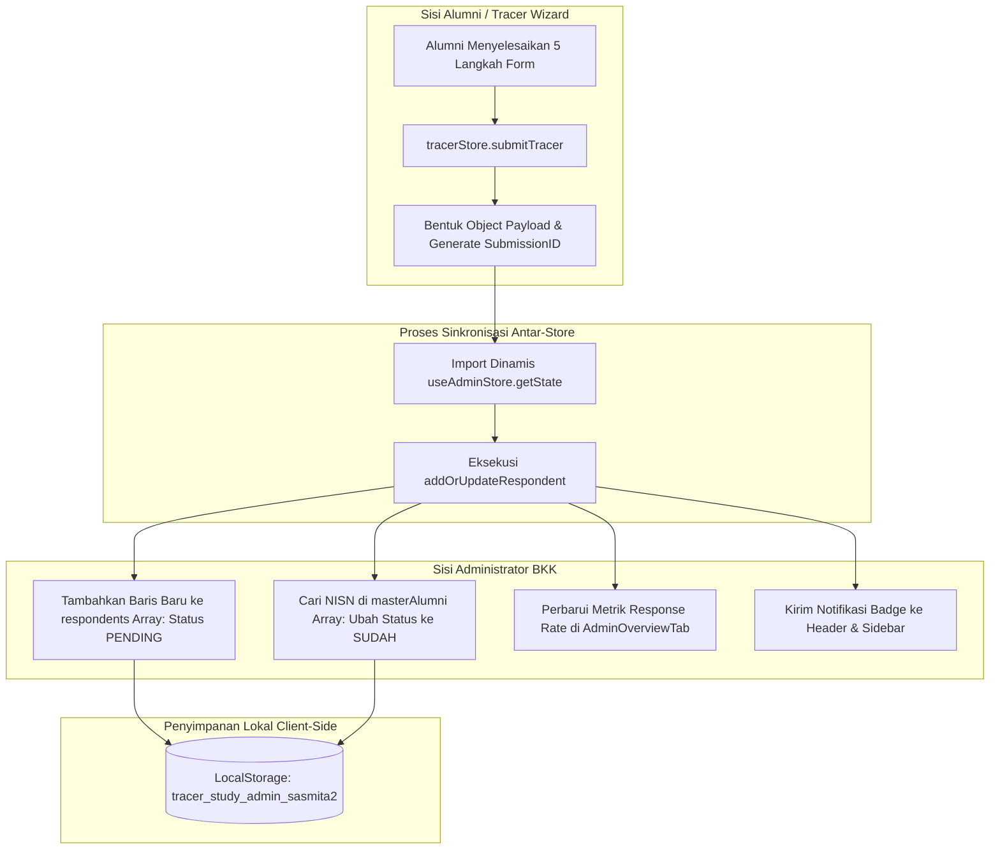
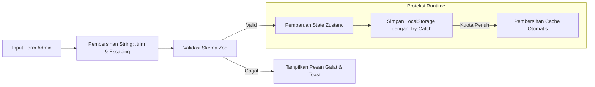

# SPESIFIKASI ARSITEKTUR TEKNIS & REKAYASA PERANGKAT LUNAK
## Panel Administrator Bursa Kerja Khusus (BKK) & Tracer Study
### SMK Sasmita Jaya 2 Pamulang

---

## DAFTAR ISI
1. [Arsitektur Perangkat Lunak & Tumpukan Teknologi](#1-arsitektur-perangkat-lunak--tumpukan-teknologi)
2. [Peta Struktur Berkas & Modul Dashboard](#2-peta-struktur-berkas--modul-dashboard)
3. [Spesifikasi Model Data & Skema TypeScript](#3-spesifikasi-model-data--skema-typescript)
4. [Mekanisme Manajemen State & Sinkronisasi Dua Arah](#4-mekanisme-manajemen-state--sinkronisasi-dua-arah)
5. [Arsitektur Komponen UI Kustom & Sistem Desain](#5-arsitektur-komponen-ui-kustom--sistem-desain)
6. [Engine Ekspor Berkas & Format Dokumen Cetak](#6-engine-ekspor-berkas--format-dokumen-cetak)
7. [Aspek Keamanan, Validasi Data, dan Penanganan Galat](#7-aspek-keamanan-validasi-data-dan-penanganan-galat)
8. [Panduan Kompilasi, Pengujian & Penerapan Sistem (Deployment)](#8-panduan-kompilasi-pengujian--penerapan-sistem-deployment)

---

## 1. Arsitektur Perangkat Lunak & Tumpukan Teknologi

Sistem Panel Administrator BKK dibangun menggunakan pola arsitektur **Single Page Application (SPA)** berbasis komponen modular reaktif dengan prinsip *separation of concerns* (pemisahan tanggung jawab antarmuka, logika bisnis, dan persistensi data).

```
┌──────────────────────────────────────────────────────────────────────────────────────────┐
│                             LAPISAN APLIKASI WEB (FRONTEND SPA)                         │
├──────────────────────────────────────────────────────────────────────────────────────────┤
│ 1. Antarmuka Pengguna (UI Layer):                                                        │
│    • React 18 (Hooks, Suspense, Error Boundary)                                          │
│    • TailwindCSS (Desain Responsif, Tema Navy #0d2346, Glassmorphism, Micro-animations)  │
│    • Lucide React (Pustaka Ikon Grafis Vektor Modern)                                    │
├──────────────────────────────────────────────────────────────────────────────────────────┤
│ 2. Logika Bisnis & Pengelola Keadaan (State Management Layer):                           │
│    • Zustand Store dengan Middleware Persist (LocalStorage Client-side Database)         │
│    • TypeScript 5 (Strict Type Checking, Zero Any Tolerance)                             │
│    • Zod Resolver & React Hook Form (Validasi Skema Kuesioner)                           │
├──────────────────────────────────────────────────────────────────────────────────────────┤
│ 3. Lapisan Utilitas & Ekspor (Utility & Rendering Engine Layer):                         │
│    • CSV Serializer & Blob Download Generator                                            │
│    • CSS @media print Template Engine (Standar Dokumen A4 Kop Naskah Dinas)              │
│    • React Router DOM v6 (Routing SPA, Parameter URL, & Auth Guard)                      │
└──────────────────────────────────────────────────────────────────────────────────────────┘
```

### Rincian Tumpukan Teknologi (*Technology Stack*):
- **Bahasa Utama**: TypeScript 5.2+ (Mencegah kesalahan waktu proses (*runtime error*) dan memastikan integritas antarmuka data).
- **Kerangka Kerja UI**: React 18.2+ dengan Pola Functional Components & Hooks.
- **Pengemas Modul (*Bundler*)**: Vite 5+ (Waktu kompilasi cepat dan *Hot Module Replacement* instan).
- **Pengelola State Global**: Zustand 4.4+ (Ringan, tanpa *boilerplate Redux*, mendukung *middleware persist* berbasis `localStorage`).
- **Styling & Desain**: Tailwind CSS 3.4+ dengan konfigurasi warna korporat kustom (`#0d2346` / Sasmita Navy Blue).

---

## 2. Peta Struktur Berkas & Modul Dashboard

Struktur direktori modul admin terpusat di dalam folder `src/components/dashboard/` dan `src/store/`:

```
web_alumni/
├── src/
│   ├── components/
│   │   ├── dashboard/
│   │   │   ├── DashboardLayout.tsx          # Shell orkestrator tab & switch role
│   │   │   ├── DashboardSidebar.tsx         # Bilah navigasi samping responsif
│   │   │   ├── DashboardHeader.tsx          # Bilah kepala, profil admin, & notifikasi
│   │   │   ├── DashboardBreadcrumb.tsx      # Penunjuk jejak navigasi dinamis
│   │   │   ├── MailNotificationMenu.tsx     # Menu dropdown interaktif notifikasi pesan
│   │   │   ├── LokerTab.tsx                 # Tampilan bursa kerja sisi alumni
│   │   │   ├── AlumniTab.tsx                # Tampilan direktori jejaring alumni
│   │   │   └── admin/                       # Direktori Khusus Modul Pengelola BKK
│   │   │       ├── AdminOverviewTab.tsx             # Tab 1: Ringkasan metrik & KPI BKK
│   │   │       ├── AdminMasterAlumniTab.tsx         # Tab 2: Tabel data induk & WA Blast
│   │   │       ├── AdminImportModal.tsx             # Modal parsing CSV/Excel Dapodik
│   │   │       ├── AdminRespondentsTab.tsx          # Tab 3: Tabel audit kuesioner masuk
│   │   │       ├── AdminRespondentDetailDrawer.tsx  # Lembar geser samping detail audit
│   │   │       ├── AdminMessagesTab.tsx             # Tab 4: Manajemen pesan & helpdesk
│   │   │       ├── AdminNewsTab.tsx                 # Tab 5: Editor berita & pengumuman
│   │   │       ├── AdminJobsTab.tsx                 # Tab 6: Editor loker & kemitraan DUDI
│   │   │       ├── AdminExportReportTab.tsx         # Tab 7: Pusat ekspor & unduh berkas
│   │   │       ├── AdminOfficialReportPrint.tsx     # Modul cetak PDF kop resmi A4
│   │   │       └── AdminSettingsTab.tsx             # Tab 8: Konfigurasi kuota & pejabat
│   │   └── ui/                              # Komponen Antarmuka Generik & Kustom
│   │       ├── CustomSelect.tsx             # Dropdown kustom non-browser-native
│   │       ├── Pagination.tsx               # Mesin pengatur halaman responsif
│   │       ├── ConfirmModal.tsx             # Dialog konfirmasi aksi berbahaya/hapus
│   │       ├── Modal.tsx                    # Wadah popup generik
│   │       ├── Input.tsx                    # Komponen masukan teks bergaya terstandar
│   │       └── UserAvatar.tsx               # Avatar pengguna dengan fallback inisial
│   ├── store/
│   │   ├── adminStore.ts                    # Store Zustand Master Alumni, Responden, Settings
│   │   ├── contentStore.ts                  # Store Zustand Lowongan Kerja & Berita BKK
│   │   ├── authStore.ts                     # Store Zustand Autentikasi Pengguna & Role
│   │   └── tracerStore.ts                   # Store Zustand Formulir 5-Langkah Kuesioner
│   └── types/
│       └── tracer.ts                        # Definisi Tipe Data Statis TypeScript
```

---

## 3. Spesifikasi Model Data & Skema TypeScript

### 3.1 Model Data Induk Alumni (`MasterAlumniRecord`)
Menyimpan data siswa lulusan hasil impor Dapodik untuk autentikasi dan penelusuran status.

```typescript
export interface MasterAlumniRecord {
  id: string;                          // Identifier unik UUID v4
  nisn: string;                        // 10 Digit Angka Unik (Kunci Autentikasi Login Siswa)
  nik: string;                         // 16 Digit Angka NIK Kependudukan
  nama: string;                        // Nama Lengkap Siswa Lulusan
  jurusan: JurusanSMK;                 // Program Keahlian (6 Jurusan Terdaftar)
  tahunLulus: number;                  // Tahun Angkatan Kelulusan (contoh: 2024)
  noWhatsapp: string;                  // Nomor Seluler Target Follow-up Pengingat
  email: string;                       // Alamat Surel Siswa
  statusTracer: 'SUDAH' | 'BELUM';     // Penanda Pengisian Kuesioner
  submissionId?: string;               // Referensi Kunci Asing (FK) ke RespondentRecord
  submittedAt?: string;                // Cap Waktu ISO 8601 Pengiriman Formulir
  createdAt: string;                   // Cap Waktu Pendaftaran Akun
}
```

### 3.2 Model Responden Kuesioner (`RespondentRecord`)
Menyimpan hasil isian formulir kuesioner multi-langkah beserta status validasi audit staf BKK.

```typescript
export type VerificationStatus = 'PENDING' | 'VALID' | 'REVISI';

export interface RespondentRecord {
  id: string;                          // Identifier unik catatan responden
  submissionId: string;                // Kode Registrasi Kuesioner (contoh: TRC-2026-0001)
  nisn: string;                        // NISN Responden
  nik: string;                         // NIK Responden
  nama: string;                        // Nama Responden
  jurusan: JurusanSMK;                 // Program Keahlian
  tahunLulus: number;                  // Tahun Kelulusan
  noWhatsapp: string;                  // Kontak Telepon
  email: string;                       // Kontak Surel
  statusKegiatan: StatusKegiatan;      // Enum: KERJA | KULIAH | WIRAUSAHA | BELUM_KERJA | dll
  instansiKampusUsaha: string;         // Nama DUDI / Kampus / Entitas Bisnis
  jabatanProdiUsaha: string;           // Posisi Kerja / Program Studi / Jenis Usaha
  submittedAt: string;                 // Cap Waktu Kirim
  verificationStatus: VerificationStatus; // Status Audit Dokumen
  verificationNote?: string;           // Catatan Wajib jika status REVISI
  verifiedAt?: string;                 // Cap Waktu Verifikasi Dilakukan
  verifiedBy?: string;                 // Nama / Identitas Akun Verifikator
  fullPayload: TracerSubmissionPayload;// Rekap Objek Komprehensif Seluruh Jawaban Kuesioner
}
```

### 3.3 Model Konfigurasi Sistem BKK (`AdminSettings`)
Menyimpan parameter operasional dinamis dan identitas penandatangan dokumen dinas.

```typescript
export interface AdminSettings {
  targetQuota: number;                 // Sasaran Kuota Responden (contoh: 450 Siswa)
  targetYear: number;                  // Tahun Kelulusan yang Menjadi Target
  periodStart: string;                 // Tanggal Awal Survei (Format: YYYY-MM-DD)
  periodEnd: string;                   // Tanggal Akhir Survei (Format: YYYY-MM-DD)
  kepalaSekolah: string;               // Nama Pejabat Kepala Sekolah
  nipKepalaSekolah: string;            // NIP / NUPTK Kepala Sekolah
  ketuaBkk: string;                    // Nama Pejabat Ketua BKK
  nipKetuaBkk: string;                 // NIP / NUPTK Ketua BKK
  namaSekolah: string;                 // SMK Sasmita Jaya 2 Pamulang
  npsn: string;                        // 20614758
  alamatSekolah: string;               // Alamat Fisik Lembaga
  kontakBkk: string;                   // Kontak Resmi BKK
}
```

---

## 4. Mekanisme Manajemen State & Sinkronisasi Dua Arah

### 4.1 Diagram Alir Reaktivitas State (`Zustand + LocalStorage`)



### 4.2 Logika Pembaruan Atomik pada `adminStore.ts`
Implementasi fungsi `addOrUpdateRespondent` menjamin integritas referensi data:

```typescript
addOrUpdateRespondent: (payload, submissionId) => {
  set((state) => {
    // 1. Buat catatan responden baru
    const newRecord: RespondentRecord = {
      id: crypto.randomUUID(),
      submissionId: submissionId || `TRC-${new Date().getFullYear()}-${Date.now().toString().slice(-4)}`,
      nisn: payload.identitas.nisn,
      nik: payload.identitas.nik,
      nama: payload.identitas.nama_lengkap,
      jurusan: payload.identitas.jurusan,
      tahunLulus: payload.identitas.tahun_lulus,
      noWhatsapp: payload.identitas.no_whatsapp,
      email: payload.identitas.email,
      statusKegiatan: payload.aktivitas.status_kegiatan,
      instansiKampusUsaha: extractInstansiName(payload),
      jabatanProdiUsaha: extractPositionName(payload),
      submittedAt: new Date().toISOString(),
      verificationStatus: 'PENDING',
      fullPayload: payload,
    };

    // 2. Perbarui status kuesioner pada tabel Master Alumni
    const updatedMaster = state.masterAlumni.map((alumni) => {
      if (alumni.nisn === payload.identitas.nisn) {
        return {
          ...alumni,
          statusTracer: 'SUDAH' as const,
          submissionId: newRecord.submissionId,
          submittedAt: newRecord.submittedAt,
        };
      }
      return alumni;
    });

    // 3. Simpan state secara imutabel
    return {
      respondents: [newRecord, ...state.respondents.filter((r) => r.nisn !== payload.identitas.nisn)],
      masterAlumni: updatedMaster,
    };
  });
}
```

---

## 5. Arsitektur Komponen UI Kustom & Sistem Desain

Sistem antarmuka panel admin dirancang dengan prinsip estetika tinggi, performa tinggi (*zero lag*), dan kepatuhan penuh terhadap pedoman UI non-browser-native.

### 5.1 Komponen Dropdown Kustom (`CustomSelect.tsx`)
Menggantikan seluruh elemen bawaan browser `<select>` yang kaku menjadi menu mengambang (*floating custom popover*) dengan animasi lembut dan navigasi keyboard:

```typescript
export interface CustomSelectProps {
  label?: string;
  error?: string;
  helperText?: string;
  requiredStar?: boolean;
  options: Array<{ value: string | number; label: string }>;
  value: string | number;
  onChange: (value: string) => void;
  placeholder?: string;
  className?: string;
  triggerClassName?: string;
  triggerSize?: 'sm' | 'md' | 'lg';
  disabled?: boolean;
  id?: string;
}
```
**Fitur Utama**:
- Penutupan otomatis saat klik di luar area (*click outside listener*) dan penekanan tombol `Escape`.
- Indikator status terpilih dengan tanda centang (*Check icon*) dan latar belakang aksen tema `#0d2346`.
- Aksesibilitas penuh menggunakan atribut `aria-haspopup="listbox"` dan `aria-expanded`.

### 5.2 Komponen Paginasi Responsif (`Pagination.tsx`)
Mengatur pemecahan data tabel panjang secara dinamis:

```typescript
export interface PaginationProps {
  currentPage: number;
  totalPages: number;
  onPageChange: (page: number) => void;
  totalItems?: number;
  itemsPerPage?: number;
  itemName?: string;      // Contoh: 'siswa', 'responden', 'lowongan', 'berita'
  className?: string;
  showInfo?: boolean;
}
```
**Perilaku Adaptif**:
- **Jika data $\le$ 15 baris** (`totalPages <= 1`): Kontrol tombol otomatis disembunyikan dan hanya menampilkan ringkasan informasi bersih (*"Menampilkan 12 data"*).
- **Jika data $>$ 15 baris** (`totalPages > 1`): Kontrol tombol halaman aktif lengkap dengan elipsis (`•••`) dan tombol *Sebelumnya / Berikutnya*.

### 5.3 Komponen Dialog Konfirmasi Aman (`ConfirmModal.tsx`)
Digunakan untuk mencegah eksekusi aksi destruktif (seperti penghapusan data master, lowongan, atau berita) secara tidak sengaja:
- Latar belakang redup (*backdrop blur*).
- Tombol aksi dengan pembeda warna semantik (`danger` dengan warna merah rose vs `primary` navy).

---

## 6. Engine Ekspor Berkas & Format Dokumen Cetak

### 6.1 Algoritma Pembentukan CSV Standar Ditjen Vokasi
Fungsi serializer menghasilkan berkas CSV dengan sanitasi karakter khusus dan pembatas koma baku:

```typescript
export const generateVokasiCSV = (respondents: RespondentRecord[]): string => {
  const headers = [
    'No', 'NISN', 'NIK', 'Nama Lengkap', 'Program Keahlian', 'Tahun Lulus',
    'No WhatsApp', 'Email', 'Status Aktivitas', 'Nama Instansi/Kampus/Usaha',
    'Jabatan/Prodi', 'Gaji Bulanan', 'Linieritas Kejuruan', 'Nama Atasan/HRD',
    'Kontak Atasan/HRD', 'Skor Relevansi (1-5)', 'Tanggal Submit', 'Status Verifikasi'
  ].join(',');

  const rows = respondents.map((r, idx) => {
    const p = r.fullPayload;
    return [
      idx + 1,
      `"${r.nisn}"`,
      `"${r.nik}"`,
      `"${sanitizeCSV(r.nama)}"`,
      `"${r.jurusan}"`,
      r.tahunLulus,
      `"${r.noWhatsapp}"`,
      `"${r.email}"`,
      `"${r.statusKegiatan}"`,
      `"${sanitizeCSV(r.instansiKampusUsaha)}"`,
      `"${sanitizeCSV(r.jabatanProdiUsaha)}"`,
      `"${sanitizeCSV(p.pekerjaan?.gaji_bulanan || '-')}"`,
      `"${p.pekerjaan?.keselarasan_kejuruan || '-'}"`,
      `"${sanitizeCSV(p.pekerjaan?.nama_atasan || '-')}"`,
      `"${sanitizeCSV(p.pekerjaan?.kontak_atasan || '-')}"`,
      p.evaluasi?.relevansi_kurikulum || '-',
      `"${new Date(r.submittedAt).toLocaleDateString('id-ID')}"`,
      `"${r.verificationStatus}"`
    ].join(',');
  });

  return [headers, ...rows].join('\n');
};
```

### 6.2 Konfigurasi Cetak Naskah Dinas A4 (`AdminOfficialReportPrint.tsx`)
Memanfaatkan CSS Print Media Queries untuk menata dokumen fisik secara presisi:

```css
@media print {
  @page {
    size: A4 portrait;
    margin: 15mm 15mm 15mm 15mm;
  }
  body {
    background-color: #ffffff !important;
    font-size: 10pt;
  }
  .no-print {
    display: none !important;
  }
  .page-break-inside-avoid {
    break-inside: avoid;
    page-break-inside: avoid;
  }
}
```

---

## 7. Aspek Keamanan, Validasi Data, dan Penanganan Galat



### Prosedur Keamanan yang Diterapkan:
1. **Pencegahan Data Korup pada Impor CSV**:
   - Berkas CSV melewati verifikasi struktur header sebelum dibaca.
   - Pengecekan ekspresi reguler (*regex*) pada NISN (harus 10 digit numerik) dan nomor WhatsApp (harus format nomor telepon valid).
2. **Penanganan Fallback Gambar Rusak**:
   - Seluruh tag `` pada modul berita dan avatar dilengkapi dengan *event handler* `onError` untuk beralih ke gambar default sistem (*placeholder assets*).
3. **Pemberitahuan Interaktif (*Toast Notification*)**:
   - Setiap operasi CRUD (Tambah, Perbarui, Hapus, Verifikasi) memicu notifikasi toast dengan visual semantik hijau (sukses) atau merah (galat).

---

## 8. Panduan Kompilasi, Pengujian & Penerapan Sistem (Deployment)

### 8.1 Verifikasi Tipe Data & Linting
Sebelum melakukan kompilasi ke tahap produksi, jalankan perintah pengujian statis berikut:

```bash
# 1. Pengecekan Type Safety TypeScript (Wajib Exit Code 0)
npx tsc --noEmit

# 2. Pengujian Server Pengembangan Lokal
npm run dev
```

### 8.2 Prosedur Kompilasi Produksi (*Build Artifact*)
```bash
# Menghasilkan berkas statis teroptimasi di direktori /dist
npm run build
```

### 8.3 Konfigurasi Web Server Produksi (`public/.htaccess` untuk Apache/cPanel)
Memastikan perutean SPA (*fallback rewrite*) dan kompresi berkas berjalan optimal:

```apache
<IfModule mod_rewrite.c>
  RewriteEngine On
  RewriteBase /
  RewriteRule ^index\.html$ - [L]
  RewriteCond %{REQUEST_FILENAME} !-f
  RewriteCond %{REQUEST_FILENAME} !-d
  RewriteRule . /index.html [L]
</IfModule>

# Header Keamanan
<IfModule mod_headers.c>
  Header set X-Content-Type-Options "nosniff"
  Header set X-Frame-Options "SAMEORIGIN"
</IfModule>

# Kompresi Aset Statis
<IfModule mod_deflate.c>
  AddOutputFilterByType DEFLATE text/html text/plain text/xml text/css application/javascript application/json image/svg+xml
</IfModule>
```

---
*Dokumen spesifikasi teknis ini menjadi acuan baku pengembangan, pemeliharaan (*maintenance*), dan audit rekayasa perangkat lunak sistem Tracer Study SMK Sasmita Jaya 2 Pamulang.*
