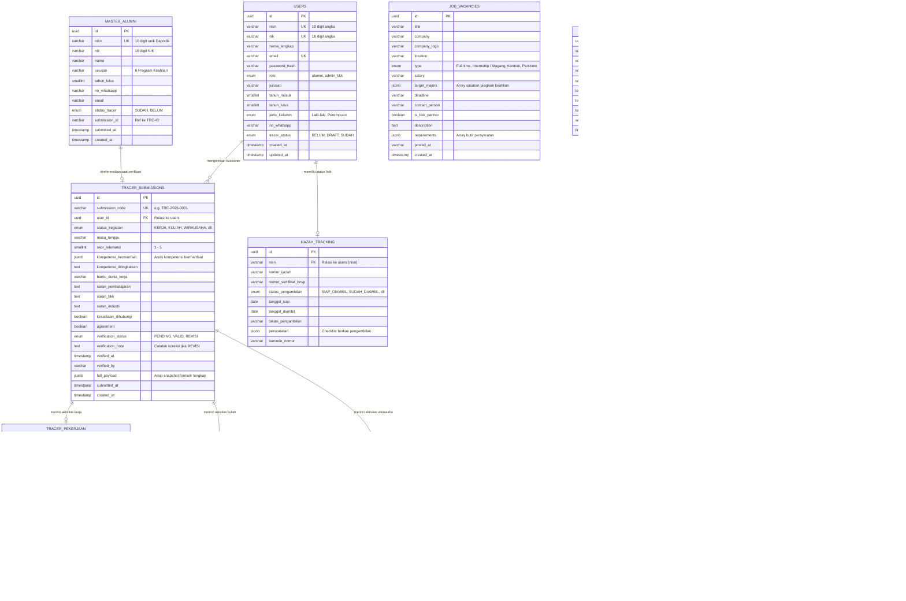

# Skema Basis Data Relasional & Pemetaan LocalStorage
## Sistem Informasi Alumni & Tracer Study SMK Sasmita Jaya 2

---

## 1. Pendahuluan & Arsitektur Pemetaan Data

Dokumen ini menjelaskan rancangan arsitektur basis data relasional (*Relational Database Management System - RDBMS*) seperti **PostgreSQL / Supabase / MySQL** yang dinormalisasi secara penuh (Bentuk Normal Ketiga / *Third Normal Form - 3NF*) dari struktur data *LocalStorage* (*Zustand State Persistence*) yang beroperasi pada aplikasi sisi klien (*frontend*).

### Perbandingan Arsitektur: LocalStorage Klien vs Basis Data Relasional Server

```
┌──────────────────────────────────────────────────────────────────────────────────────────────────┐
│                             PENYIMPANAN SISI KLIEN (LOCALSTORAGE)                                │
├────────────────────────────────┬─────────────────────────────────────────────────────────────────┤
│ 'alumni_auth_session'          │ Sesi autentikasi aktif, profil pengguna, & peran (alumni/admin) │
│ 'tracer_study_sasmita2_store'  │ Isian formulir kuesioner 5 langkah (Objek JSON bersarang)       │
│ 'tracer_study_admin_sasmita2'  │ Master data Dapodik, antrean verifikasi responden, & pengaturan │
│ 'tracer_study_content_sasmita2'│ Pangkalan data berita BKK & lowongan kerja/magang               │
└────────────────────────────────┴─────────────────────────────────────────────────────────────────┘
                                                 │
                                                 ▼ Transaksi API HTTP REST / JSON
┌──────────────────────────────────────────────────────────────────────────────────────────────────┐
│                            BASIS DATA RELASIONAL SERVER (POSTGRESQL / SUPABASE)                  │
├────────────────────────────────┬─────────────────────────────────────────────────────────────────┤
│ 1. users                       │ Akun terdaftar, kredensial login, & profil dasar alumni/admin   │
│ 2. master_alumni               │ Data induk kelulusan hasil pra-populasi Dapodik sekolah         │
│ 3. tracer_submissions          │ Header kuesioner, evaluasi kurikulum, & status audit verifikasi │
│ 4. tracer_pekerjaan            │ Rincian aktivitas bekerja, linieritas, & kontak atasan DUDI    │
│ 5. tracer_kuliah               │ Rincian perguruan tinggi, jenjang studi, & program studi        │
│ 6. tracer_wirausaha            │ Rincian badan usaha mandiri, omzet, & legalitas usaha           │
│ 7. ijazah_tracking             │ Pengecekan status fisik ijazah & sertifikat kompetensi BNSP     │
│ 8. job_vacancies               │ Bursa lowongan pekerjaan & kesempatan magang mitra BKK          │
│ 9. news_items                  │ Publikasi berita, artikel karir, & pengumuman BKK               │
│ 10. admin_messages             │ Kotak masuk pengaduan alumni, helpdesk login, & tindak lanjut   │
│ 11. admin_settings             │ Parameter kuota target, periode survei, & pejabat penandatangan │
└────────────────────────────────┴─────────────────────────────────────────────────────────────────┘
```

---

## 2. Struktur Kunci LocalStorage yang Aktif

Pada peramban web pengguna (*client browser*), terdapat 4 kunci (*keys*) utama yang dikelola oleh pustaka Zustand dengan *middleware persist*:

### 2.1 Kunci: `alumni_auth_session`
* **Pengelola State**: [`src/store/authStore.ts`](file:///c:/Arif/projek%20coding/web_alumni/src/store/authStore.ts)
* **Tipe Data**: `UserSession` pada [`src/types/tracer.ts`](file:///c:/Arif/projek%20coding/web_alumni/src/types/tracer.ts)
* **Contoh JSON Mentah**:
```json
{
  "state": {
    "isAuthenticated": true,
    "user": {
      "id": "usr-001",
      "nisn": "0051234567",
      "nama": "Ahmad Dani",
      "email": "ahmaddani@example.com",
      "role": "alumni",
      "jurusan": "Teknik Komputer dan Jaringan",
      "tahun_lulus": 2024,
      "tracerStatus": "SUDAH",
      "submissionId": "TRC-2026-0001",
      "submittedAt": "2026-09-26T13:38:16Z",
      "jenisKelamin": "L"
    },
    "lastDashboardActivity": 1759114696000
  },
  "version": 0
}
```

### 2.2 Kunci: `tracer_study_sasmita2_store`
* **Pengelola State**: [`src/store/tracerStore.ts`](file:///c:/Arif/projek%20coding/web_alumni/src/store/tracerStore.ts)
* **Skema Validasi**: [`src/schemas/tracerSchema.ts`](file:///c:/Arif/projek%20coding/web_alumni/src/schemas/tracerSchema.ts)
* **Contoh JSON Mentah**:
```json
{
  "state": {
    "currentStep": 5,
    "hasStartedSurvey": true,
    "identitas": {
      "nama_lengkap": "Ahmad Dani",
      "nisn": "0051234567",
      "nik": "3674012345670001",
      "tahun_masuk": 2021,
      "tahun_lulus": 2024,
      "jurusan": "Teknik Komputer dan Jaringan",
      "no_whatsapp": "081298765432",
      "email": "ahmaddani@example.com",
      "jenis_kelamin": "Laki-laki"
    },
    "status_kegiatan": "KERJA_KULIAH",
    "masa_tunggu": "< 3 bulan",
    "detail_kerja": {
      "nama_perusahaan": "PT Solusi Teknologi Nusantara",
      "jabatan": "Technical Support",
      "bidang_pekerjaan": "Teknologi Informasi & Jaringan",
      "kota_kabupaten": "Tangerang Selatan",
      "status_pekerjaan": "Tetap",
      "kesesuaian_jurusan": "Sangat sesuai",
      "kisaran_penghasilan": "Rp 4.000.000 – Rp 7.000.000",
      "nama_atasan": "Ir. Hendra Gunawan",
      "kontak_atasan": "081199887766"
    },
    "detail_kuliah": {
      "nama_kampus": "Universitas Pamulang",
      "program_studi": "Teknik Informatika",
      "jenjang": "S1",
      "status_kuliah": "Aktif",
      "alamat_kampus": "Jl. Surya Kencana No. 1, Pamulang"
    },
    "detail_usaha": null,
    "evaluasi": {
      "skor_relevansi": 5,
      "kompetensi_bermanfaat": ["Kompetensi teknis", "Komunikasi", "Kerja sama"],
      "kompetensi_ditingkatkan": "Bahasa Inggris dan praktik cloud computing",
      "bantu_dunia_kerja": "Sangat membantu",
      "saran_pembelajaran": "Perbanyak jam praktik industri dan sertifikasi kejuruan.",
      "saran_bkk": "Perluas kemitraan rekrutmen kampus dan industri Jabodetabek.",
      "saran_industri": "Tingkatkan program guru tamu dari praktisi industri.",
      "kesediaan_dihubungi": true
    },
    "agreement": true,
    "isSubmitted": true,
    "lastSubmissionId": "TRC-2026-0001",
    "lastSubmittedAt": "2026-09-26T13:38:16Z"
  },
  "version": 0
}
```

### 2.3 Kunci: `tracer_study_admin_sasmita2`
* **Pengelola State**: [`src/store/adminStore.ts`](file:///c:/Arif/projek%20coding/web_alumni/src/store/adminStore.ts)
* **Memuat**: Array `masterAlumni`, Array `respondents` (dengan status audit `PENDING` / `VALID` / `REVISI`), dan objek `settings`.

### 2.4 Kunci: `tracer_study_content_sasmita2`
* **Pengelola State**: [`src/store/contentStore.ts`](file:///c:/Arif/projek%20coding/web_alumni/src/store/contentStore.ts)
* **Memuat**: Array `newsList` (Berita BKK) dan Array `jobList` (Lowongan Pekerjaan/Magang).

---

## 3. Entity Relationship Diagram (ERD Relasional)

Berikut rancangan diagram relasi entitas (*Entity-Relationship Diagram*) 3NF yang menghubungkan seluruh subsistem alumni dan panel administrator:



---

## 4. Kamus Data Tabel Relasional (*Data Dictionary*)

### 4.1 Tabel: `users`
Menyimpan data otentikasi akun alumni dan staf pengelola BKK.

| Kolom | Tipe Data | Constraint | Deskripsi |
| :--- | :--- | :--- | :--- |
| `id` | `UUID` | `PRIMARY KEY, DEFAULT gen_random_uuid()` | Pengenal unik pengguna |
| `nisn` | `VARCHAR(10)` | `NOT NULL, UNIQUE, INDEX` | 10 digit NISN resmi (kunci login siswa) |
| `nik` | `VARCHAR(16)` | `NULL, UNIQUE` | 16 digit Nomor Induk Kependudukan |
| `nama_lengkap` | `VARCHAR(120)` | `NOT NULL` | Nama siswa sesuai ijazah |
| `email` | `VARCHAR(100)` | `NOT NULL, UNIQUE, INDEX` | Alamat surel aktif |
| `password_hash` | `VARCHAR(255)` | `NOT NULL` | Hash sandi (Bcrypt / Argon2) |
| `role` | `VARCHAR(20)` | `NOT NULL, DEFAULT 'alumni'` | `alumni` atau `admin_bkk` |
| `jurusan` | `VARCHAR(100)` | `NOT NULL` | 1 dari 6 program keahlian SMK |
| `tahun_masuk` | `SMALLINT` | `NOT NULL` | Tahun angkatan masuk (contoh: 2021) |
| `tahun_lulus` | `SMALLINT` | `NOT NULL` | Tahun kelulusan (contoh: 2024) |
| `jenis_kelamin` | `VARCHAR(15)` | `NOT NULL` | `Laki-laki` atau `Perempuan` |
| `no_whatsapp` | `VARCHAR(25)` | `NOT NULL` | Nomor kontak telepon / WhatsApp |
| `avatar_url` | `TEXT` | `NULL` | Tautan foto profil |
| `tracer_status` | `VARCHAR(10)` | `NOT NULL, DEFAULT 'BELUM'` | `BELUM`, `DRAFT`, atau `SUDAH` |
| `created_at` | `TIMESTAMPTZ` | `NOT NULL, DEFAULT NOW()` | Cap waktu pendaftaran |
| `updated_at` | `TIMESTAMPTZ` | `NOT NULL, DEFAULT NOW()` | Cap waktu pembaruan |

---

### 4.2 Tabel: `master_alumni`
Menyimpan pangkalan data pra-populasi lulusan dari sistem Dapodik sekolah untuk keperluan autentikasi dan *follow-up*.

| Kolom | Tipe Data | Constraint | Deskripsi |
| :--- | :--- | :--- | :--- |
| `id` | `UUID` | `PRIMARY KEY, DEFAULT gen_random_uuid()` | Pengenal unik catatan siswa |
| `nisn` | `VARCHAR(10)` | `NOT NULL, UNIQUE, INDEX` | NISN terdaftar di buku induk |
| `nik` | `VARCHAR(16)` | `NOT NULL` | NIK kependudukan |
| `nama` | `VARCHAR(120)` | `NOT NULL` | Nama lengkap siswa |
| `jurusan` | `VARCHAR(100)` | `NOT NULL` | Program keahlian kejuruan |
| `tahun_lulus` | `SMALLINT` | `NOT NULL` | Tahun kelulusan target survei |
| `no_whatsapp` | `VARCHAR(25)` | `NOT NULL` | Nomor kontak untuk WhatsApp Reminder |
| `email` | `VARCHAR(100)` | `NOT NULL` | Alamat surel |
| `status_tracer` | `VARCHAR(10)` | `NOT NULL, DEFAULT 'BELUM'` | Status kuesioner: `SUDAH` / `BELUM` |
| `submission_id` | `VARCHAR(30)` | `NULL` | ID formulir terkait jika sudah mengisi |
| `submitted_at` | `TIMESTAMPTZ` | `NULL` | Waktu pengiriman kuesioner |
| `created_at` | `TIMESTAMPTZ` | `NOT NULL, DEFAULT NOW()` | Waktu data diimpor |

---

### 4.3 Tabel: `tracer_submissions`
Menyimpan data header kuesioner yang telah dikirimkan, evaluasi sekolah, dan catatan verifikasi admin.

| Kolom | Tipe Data | Constraint | Deskripsi |
| :--- | :--- | :--- | :--- |
| `id` | `UUID` | `PRIMARY KEY, DEFAULT gen_random_uuid()` | ID unik entri kuesioner |
| `submission_code` | `VARCHAR(30)` | `NOT NULL, UNIQUE, INDEX` | Kode registrasi (contoh: `TRC-2026-0001`) |
| `user_id` | `UUID` | `NOT NULL, REFERENCES users(id) ON DELETE CASCADE` | Relasi akun pengisi |
| `status_kegiatan` | `VARCHAR(25)` | `NOT NULL` | Status BMW (`KERJA`, `KULIAH`, dll) |
| `masa_tunggu` | `VARCHAR(50)` | `NULL` | Durasi waktu transisi setelah lulus |
| `skor_relevansi` | `SMALLINT` | `NOT NULL, CHECK (skor_relevansi BETWEEN 1 AND 5)` | Skor skala Likert 1-5 kepuasan kurikulum |
| `kompetensi_bermanfaat`| `JSONB` | `NOT NULL, DEFAULT '[]'::jsonb` | Array butir kompetensi yang bermanfaat |
| `kompetensi_ditingkatkan`| `TEXT` | `NULL` | Keterampilan yang perlu ditingkatkan |
| `bantu_dunia_kerja` | `VARCHAR(50)` | `NULL` | Tingkat kebermanfaatan sekolah |
| `saran_pembelajaran` | `TEXT` | `NULL` | Evaluasi praktikum bengkel & kurikulum |
| `saran_bkk` | `TEXT` | `NULL` | Evaluasi pelayanan bursa kerja BKK |
| `saran_industri` | `TEXT` | `NULL` | Saran keterlibatan praktisi DUDI |
| `kesediaan_dihubungi` | `BOOLEAN` | `NOT NULL, DEFAULT TRUE` | Izin tindak lanjut di masa depan |
| `agreement` | `BOOLEAN` | `NOT NULL, DEFAULT TRUE` | Pernyataan keabsahan isian |
| `verification_status` | `VARCHAR(15)` | `NOT NULL, DEFAULT 'PENDING'` | `PENDING`, `VALID`, atau `REVISI` |
| `verification_note` | `TEXT` | `NULL` | Alasan perbaikan (wajib jika status `REVISI`) |
| `verified_at` | `TIMESTAMPTZ` | `NULL` | Waktu audit dieksekusi |
| `verified_by` | `VARCHAR(100)` | `NULL` | Nama/ID staf verifikator |
| `full_payload` | `JSONB` | `NOT NULL` | Salinan arsip lengkap 5 langkah formulir |
| `submitted_at` | `TIMESTAMPTZ` | `NOT NULL, DEFAULT NOW()` | Cap waktu pengiriman data |
| `created_at` | `TIMESTAMPTZ` | `NOT NULL, DEFAULT NOW()` | Cap waktu pembuatan baris |

---

### 4.4 Tabel: `tracer_pekerjaan`
Menyimpan rincian pekerjaan lulusan beserta data atasan DUDI untuk keperluan audit survei kepuasan mitra.

| Kolom | Tipe Data | Constraint | Deskripsi |
| :--- | :--- | :--- | :--- |
| `id` | `UUID` | `PRIMARY KEY, DEFAULT gen_random_uuid()` | ID unik entri pekerjaan |
| `submission_id` | `UUID` | `NOT NULL, REFERENCES tracer_submissions(id) ON DELETE CASCADE` | Relasi ke kuesioner utama |
| `nama_perusahaan` | `VARCHAR(150)` | `NOT NULL` | Nama instansi / PT tempat bekerja |
| `jabatan` | `VARCHAR(100)` | `NOT NULL` | Posisi / jabatan kerja |
| `bidang_pekerjaan` | `VARCHAR(100)` | `NULL` | Sektor industri pekerjaan |
| `kota_kabupaten` | `VARCHAR(100)` | `NULL` | Kota lokasi penempatan kerja |
| `status_pekerjaan` | `VARCHAR(50)` | `NULL` | `Tetap`, `Kontrak`, `Magang`, `Freelance` |
| `kesesuaian_jurusan` | `VARCHAR(50)` | `NOT NULL` | `Sangat sesuai`, `Sesuai`, dll |
| `kisaran_penghasilan`| `VARCHAR(50)` | `NULL` | Rentang upah/gaji per bulan |
| `alamat_perusahaan` | `TEXT` | `NULL` | Alamat kantor operasional |
| `nama_atasan` | `VARCHAR(100)` | `NULL` | Nama atasan / supervisor DUDI |
| `kontak_atasan` | `VARCHAR(30)` | `NULL` | Nomor telepon/surel kontak atasan |
| `sumber_info_kerja` | `VARCHAR(50)` | `NULL` | Saluran rekrutmen (`BKK`, `Mandiri`, dll) |
| `tanggal_mulai_kerja`| `VARCHAR(10)` | `NULL` | Format `YYYY-MM` |
| `jenis_sertifikat` | `VARCHAR(50)` | `NULL` | `BNSP`, `SEKOLAH`, atau `TIDAK_ADA` |
| `nama_sertifikat` | `VARCHAR(150)` | `NULL` | Nama skema sertifikasi kompetensi |

---

### 4.5 Tabel: `tracer_kuliah`
Menyimpan data perkuliahan lulusan yang melanjutkan pendidikan ke jenjang diploma atau sarjana.

| Kolom | Tipe Data | Constraint | Deskripsi |
| :--- | :--- | :--- | :--- |
| `id` | `UUID` | `PRIMARY KEY, DEFAULT gen_random_uuid()` | ID unik entri perkuliahan |
| `submission_id` | `UUID` | `NOT NULL, REFERENCES tracer_submissions(id) ON DELETE CASCADE` | Relasi ke kuesioner utama |
| `nama_kampus` | `VARCHAR(150)` | `NOT NULL` | Nama perguruan tinggi / politeknik |
| `program_studi` | `VARCHAR(100)` | `NOT NULL` | Nama jurusan / prodi kuliah |
| `jenjang` | `VARCHAR(20)` | `NOT NULL` | `D3`, `D4`, `S1`, `Lainnya` |
| `status_kuliah` | `VARCHAR(50)` | `NULL` | `Aktif`, `Lulus`, `Cuti`, dll |
| `alamat_kampus` | `TEXT` | `NULL` | Alamat kampus |

---

### 4.6 Tabel: `tracer_wirausaha`
Menyimpan data wirausaha lulusan yang merintis bisnis mandiri.

| Kolom | Tipe Data | Constraint | Deskripsi |
| :--- | :--- | :--- | :--- |
| `id` | `UUID` | `PRIMARY KEY, DEFAULT gen_random_uuid()` | ID unik entri usaha |
| `submission_id` | `UUID` | `NOT NULL, REFERENCES tracer_submissions(id) ON DELETE CASCADE` | Relasi ke kuesioner utama |
| `nama_usaha` | `VARCHAR(150)` | `NOT NULL` | Nama merk dagang / badan usaha |
| `bidang_usaha` | `VARCHAR(100)` | `NULL` | Deskripsi bidang industri usaha |
| `kategori_usaha` | `VARCHAR(50)` | `NULL` | Kategori (`Jasa`, `Kuliner`, `IT`, dll) |
| `lama_usaha` | `VARCHAR(50)` | `NULL` | Durasi berdiri usaha |
| `jumlah_karyawan` | `VARCHAR(50)` | `NULL` | Kapasitas tenaga kerja yang terserap |
| `kesesuaian_kompetensi`| `VARCHAR(50)` | `NULL` | Relevansi keahlian SMK |
| `alamat_usaha` | `TEXT` | `NULL` | Lokasi toko / workshop usaha |
| `tanggal_mulai_usaha`| `VARCHAR(10)` | `NULL` | Format `YYYY-MM` |

---

### 4.7 Tabel: `ijazah_tracking`
Menyimpan pelacakan fisik dokumen ijazah dan sertifikat kompetensi BNSP di tata usaha sekolah.

| Kolom | Tipe Data | Constraint | Deskripsi |
| :--- | :--- | :--- | :--- |
| `id` | `UUID` | `PRIMARY KEY, DEFAULT gen_random_uuid()` | ID unik entri ijazah |
| `nisn` | `VARCHAR(10)` | `NOT NULL, REFERENCES users(nisn) ON DELETE CASCADE` | Relasi ke NISN siswa |
| `nomor_ijazah` | `VARCHAR(50)` | `NOT NULL` | Nomor seri lembar ijazah negara |
| `nomor_sertifikat_bnsp`| `VARCHAR(50)` | `NULL` | Nomor register sertifikat BNSP |
| `status_pengambilan` | `VARCHAR(50)` | `NOT NULL, DEFAULT 'SIAP_DIAMBIL'` | `SIAP_DIAMBIL`, `SUDAH_DIAMBIL`, dll |
| `tanggal_siap` | `DATE` | `NULL` | Tanggal dokumen siap diambil |
| `tanggal_diambil` | `DATE` | `NULL` | Tanggal fisik berkas diserahkan |
| `lokasi_pengambilan` | `VARCHAR(100)` | `NOT NULL` | Ruang loket (contoh: *Ruang Tata Usaha*) |
| `persyaratan` | `JSONB` | `NOT NULL, DEFAULT '[]'::jsonb` | Daftar dokumen syarat bebas pustaka/SPP |
| `barcode_nomor` | `VARCHAR(50)` | `NOT NULL` | Kode barcode pengambilan |
| `created_at` | `TIMESTAMPTZ` | `NOT NULL, DEFAULT NOW()` | Cap waktu pembuatan baris |

---

### 4.8 Tabel: `job_vacancies`
Menyimpan daftar lowongan kerja dan magang industri yang terafiliasi dengan BKK.

| Kolom | Tipe Data | Constraint | Deskripsi |
| :--- | :--- | :--- | :--- |
| `id` | `UUID` | `PRIMARY KEY, DEFAULT gen_random_uuid()` | ID unik lowongan pekerjaan |
| `title` | `VARCHAR(150)` | `NOT NULL` | Judul posisi kerja (contoh: *Teknisi Mesin CNC*) |
| `company` | `VARCHAR(150)` | `NOT NULL` | Nama perusahaan mitra DUDI |
| `company_logo` | `TEXT` | `NULL` | Tautan logo perusahaan |
| `location` | `VARCHAR(100)` | `NOT NULL` | Wilayah kota penempatan kerja |
| `type` | `VARCHAR(30)` | `NOT NULL` | `Full-time`, `Internship / Magang`, `Kontrak`, dll |
| `salary` | `VARCHAR(100)` | `NOT NULL` | Estimasi kisaran gaji bulanan |
| `target_majors` | `JSONB` | `NOT NULL, DEFAULT '[]'::jsonb` | Array sasaran program keahlian |
| `deadline` | `VARCHAR(50)` | `NOT NULL` | Batas akhir pengiriman lamaran |
| `contact_person` | `VARCHAR(100)` | `NOT NULL` | Kontak HRD / surel lamaran |
| `is_bkk_partner` | `BOOLEAN` | `NOT NULL, DEFAULT TRUE` | Penanda mitra industri resmi BKK |
| `description` | `TEXT` | `NOT NULL` | Uraian deskripsi pekerjaan |
| `requirements` | `JSONB` | `NOT NULL, DEFAULT '[]'::jsonb` | Butir-butir syarat kualifikasi |
| `posted_at` | `VARCHAR(50)` | `NOT NULL` | Keterangan tanggal tayang |
| `created_at` | `TIMESTAMPTZ` | `NOT NULL, DEFAULT NOW()` | Cap waktu posting |

---

### 4.9 Tabel: `news_items`
Menyimpan artikel informasi, pengumuman BKK, dan berita karir sekolah.

| Kolom | Tipe Data | Constraint | Deskripsi |
| :--- | :--- | :--- | :--- |
| `id` | `UUID` | `PRIMARY KEY, DEFAULT gen_random_uuid()` | ID unik berita |
| `title` | `VARCHAR(200)` | `NOT NULL` | Judul berita |
| `category` | `VARCHAR(50)` | `NOT NULL` | Kategori (*BKK & Karir*, *Tracer Study*, dll) |
| `author` | `VARCHAR(100)` | `NOT NULL` | Nama redaksi penulis (*Tim Humas BKK*) |
| `read_time` | `VARCHAR(20)` | `NOT NULL` | Estimasi durasi baca (*3 min read*) |
| `image_url` | `TEXT` | `NOT NULL` | Tautan gambar sampul berita |
| `excerpt` | `TEXT` | `NOT NULL` | Ringkasan cuplikan berita untuk kartu beranda |
| `content` | `TEXT` | `NOT NULL` | Isi naskah artikel lengkap |
| `date` | `VARCHAR(50)` | `NOT NULL` | Tanggal rilis berita |
| `created_at` | `TIMESTAMPTZ` | `NOT NULL, DEFAULT NOW()` | Cap waktu rilis |

---

### 4.10 Tabel: `admin_messages`
Menyimpan pengaduan alumni dan pesan permohonan bantuan kendala data.

| Kolom | Tipe Data | Constraint | Deskripsi |
| :--- | :--- | :--- | :--- |
| `id` | `UUID` | `PRIMARY KEY, DEFAULT gen_random_uuid()` | ID unik pesan pengaduan |
| `nama` | `VARCHAR(120)` | `NOT NULL` | Nama pengirim pesan |
| `email` | `VARCHAR(100)` | `NOT NULL` | Alamat surel pengirim |
| `no_whatsapp` | `VARCHAR(25)` | `NOT NULL` | Nomor kontak telepon / WhatsApp |
| `subjek` | `VARCHAR(150)` | `NOT NULL` | Pokok bahasan pertanyaan / kendala |
| `pesan` | `TEXT` | `NOT NULL` | Uraian lengkap isi pengaduan |
| `status` | `VARCHAR(20)` | `NOT NULL, DEFAULT 'UNREAD'` | `UNREAD`, `FOLLOW_UP`, atau `RESOLVED` |
| `created_at` | `TIMESTAMPTZ` | `NOT NULL, DEFAULT NOW()` | Waktu pesan dikirimkan |
| `resolved_at` | `TIMESTAMPTZ` | `NULL` | Waktu pengaduan selesai ditangani |

---

### 4.11 Tabel: `admin_settings`
Menyimpan parameter konfigurasi kelembagaan sekolah (Tabel Baris Tunggal / *Single-row configuration*).

| Kolom | Tipe Data | Constraint | Deskripsi |
| :--- | :--- | :--- | :--- |
| `id` | `SMALLINT` | `PRIMARY KEY, DEFAULT 1, CHECK (id = 1)` | Kunci baris tunggal |
| `target_quota` | `INTEGER` | `NOT NULL, DEFAULT 450` | Target kuota responden angkatan aktif |
| `target_year` | `SMALLINT` | `NOT NULL, DEFAULT 2024` | Angkatan lulusan yang disurvei |
| `period_start` | `DATE` | `NOT NULL` | Tanggal awal pelaksanaan survei |
| `period_end` | `DATE` | `NOT NULL` | Batas akhir pengisian kuesioner |
| `kepala_sekolah` | `VARCHAR(120)` | `NOT NULL` | Nama Kepala Sekolah |
| `nip_kepala_sekolah`| `VARCHAR(50)` | `NOT NULL` | NIP Kepala Sekolah |
| `ketua_bkk` | `VARCHAR(120)` | `NOT NULL` | Nama Ketua BKK |
| `nip_ketua_bkk` | `VARCHAR(50)` | `NOT NULL` | NIP Ketua BKK |
| `nama_sekolah` | `VARCHAR(150)` | `NOT NULL` | SMK Sasmita Jaya 2 Pamulang |
| `npsn` | `VARCHAR(20)` | `NOT NULL` | Nomor Pokok Sekolah Nasional (20614758) |
| `alamat_sekolah` | `TEXT` | `NOT NULL` | Alamat domisili fisik sekolah |
| `kontak_bkk` | `VARCHAR(50)` | `NOT NULL` | Saluran layanan telepon resmi |
| `updated_at` | `TIMESTAMPTZ` | `NOT NULL, DEFAULT NOW()` | Cap waktu pembaruan konfigurasi |

---

## 5. Script DDL SQL Siap Eksekusi (PostgreSQL & Supabase)

Skrip SQL berikut dapat langsung dieksekusi pada *SQL Editor* **Supabase** atau mesin basis data **PostgreSQL**:

```sql
-- ============================================================================
-- 1. INISIALISASI EKSTENSI & ENUMERASI
-- ============================================================================
CREATE EXTENSION IF NOT EXISTS "uuid-ossp";

CREATE TYPE user_role_enum AS ENUM ('alumni', 'admin_bkk');
CREATE TYPE tracer_status_enum AS ENUM ('BELUM', 'DRAFT', 'SUDAH');
CREATE TYPE verification_status_enum AS ENUM ('PENDING', 'VALID', 'REVISI');
CREATE TYPE message_status_enum AS ENUM ('UNREAD', 'FOLLOW_UP', 'RESOLVED');
CREATE TYPE job_type_enum AS ENUM ('Full-time', 'Internship / Magang', 'Kontrak', 'Part-time');
CREATE TYPE ijazah_status_enum AS ENUM ('SIAP_DIAMBIL', 'SUDAH_DIAMBIL', 'PROSES_LEGALISIR', 'DALAM_PENCETAKAN');
CREATE TYPE status_kegiatan_enum AS ENUM (
  'KERJA',
  'KULIAH',
  'WIRAUSAHA',
  'KERJA_KULIAH',
  'WIRAUSAHA_KULIAH',
  'BELUM_KERJA',
  'LAINNYA'
);

-- ============================================================================
-- 2. TABEL USERS & MASTER DATA ALUMNI
-- ============================================================================
CREATE TABLE users (
    id UUID PRIMARY KEY DEFAULT uuid_generate_v4(),
    nisn VARCHAR(10) NOT NULL UNIQUE,
    nik VARCHAR(16) UNIQUE,
    nama_lengkap VARCHAR(120) NOT NULL,
    email VARCHAR(100) NOT NULL UNIQUE,
    password_hash VARCHAR(255) NOT NULL,
    role user_role_enum NOT NULL DEFAULT 'alumni',
    jurusan VARCHAR(100) NOT NULL,
    tahun_masuk SMALLINT NOT NULL,
    tahun_lulus SMALLINT NOT NULL,
    jenis_kelamin VARCHAR(15) NOT NULL,
    no_whatsapp VARCHAR(25) NOT NULL,
    avatar_url TEXT,
    tracer_status tracer_status_enum NOT NULL DEFAULT 'BELUM',
    created_at TIMESTAMPTZ NOT NULL DEFAULT NOW(),
    updated_at TIMESTAMPTZ NOT NULL DEFAULT NOW()
);

CREATE INDEX idx_users_nisn ON users(nisn);
CREATE INDEX idx_users_email ON users(email);
CREATE INDEX idx_users_jurusan_tahun ON users(jurusan, tahun_lulus);

CREATE TABLE master_alumni (
    id UUID PRIMARY KEY DEFAULT uuid_generate_v4(),
    nisn VARCHAR(10) NOT NULL UNIQUE,
    nik VARCHAR(16) NOT NULL,
    nama VARCHAR(120) NOT NULL,
    jurusan VARCHAR(100) NOT NULL,
    tahun_lulus SMALLINT NOT NULL,
    no_whatsapp VARCHAR(25) NOT NULL,
    email VARCHAR(100) NOT NULL,
    status_tracer tracer_status_enum NOT NULL DEFAULT 'BELUM',
    submission_id VARCHAR(30),
    submitted_at TIMESTAMPTZ,
    created_at TIMESTAMPTZ NOT NULL DEFAULT NOW()
);

CREATE INDEX idx_master_alumni_nisn ON master_alumni(nisn);
CREATE INDEX idx_master_alumni_jurusan ON master_alumni(jurusan);
CREATE INDEX idx_master_alumni_status ON master_alumni(status_tracer);

-- ============================================================================
-- 3. TABEL KUESIONER TRACER STUDY & SUB-TABEL RINCIAN BMW
-- ============================================================================
CREATE TABLE tracer_submissions (
    id UUID PRIMARY KEY DEFAULT uuid_generate_v4(),
    submission_code VARCHAR(30) NOT NULL UNIQUE,
    user_id UUID NOT NULL REFERENCES users(id) ON DELETE CASCADE,
    status_kegiatan status_kegiatan_enum NOT NULL,
    masa_tunggu VARCHAR(50),
    skor_relevansi SMALLINT NOT NULL CHECK (skor_relevansi BETWEEN 1 AND 5),
    kompetensi_bermanfaat JSONB NOT NULL DEFAULT '[]'::jsonb,
    kompetensi_ditingkatkan TEXT,
    bantu_dunia_kerja VARCHAR(50),
    saran_pembelajaran TEXT,
    saran_bkk TEXT,
    saran_industri TEXT,
    kesediaan_dihubungi BOOLEAN NOT NULL DEFAULT TRUE,
    agreement BOOLEAN NOT NULL DEFAULT TRUE,
    verification_status verification_status_enum NOT NULL DEFAULT 'PENDING',
    verification_note TEXT,
    verified_at TIMESTAMPTZ,
    verified_by VARCHAR(100),
    full_payload JSONB NOT NULL,
    submitted_at TIMESTAMPTZ NOT NULL DEFAULT NOW(),
    created_at TIMESTAMPTZ NOT NULL DEFAULT NOW()
);

CREATE INDEX idx_submissions_code ON tracer_submissions(submission_code);
CREATE INDEX idx_submissions_user_id ON tracer_submissions(user_id);
CREATE INDEX idx_submissions_status ON tracer_submissions(status_kegiatan);
CREATE INDEX idx_submissions_verification ON tracer_submissions(verification_status);

CREATE TABLE tracer_pekerjaan (
    id UUID PRIMARY KEY DEFAULT uuid_generate_v4(),
    submission_id UUID NOT NULL REFERENCES tracer_submissions(id) ON DELETE CASCADE,
    nama_perusahaan VARCHAR(150) NOT NULL,
    jabatan VARCHAR(100) NOT NULL,
    bidang_pekerjaan VARCHAR(100),
    kota_kabupaten VARCHAR(100),
    status_pekerjaan VARCHAR(50),
    kesesuaian_jurusan VARCHAR(50) NOT NULL,
    kisaran_penghasilan VARCHAR(50),
    alamat_perusahaan TEXT,
    nama_atasan VARCHAR(100),
    kontak_atasan VARCHAR(30),
    sumber_info_kerja VARCHAR(50),
    tanggal_mulai_kerja VARCHAR(10),
    jenis_sertifikat VARCHAR(50),
    nama_sertifikat VARCHAR(150),
    created_at TIMESTAMPTZ NOT NULL DEFAULT NOW()
);

CREATE INDEX idx_pekerjaan_submission ON tracer_pekerjaan(submission_id);

CREATE TABLE tracer_kuliah (
    id UUID PRIMARY KEY DEFAULT uuid_generate_v4(),
    submission_id UUID NOT NULL REFERENCES tracer_submissions(id) ON DELETE CASCADE,
    nama_kampus VARCHAR(150) NOT NULL,
    program_studi VARCHAR(100) NOT NULL,
    jenjang VARCHAR(20) NOT NULL,
    status_kuliah VARCHAR(50),
    alamat_kampus TEXT,
    created_at TIMESTAMPTZ NOT NULL DEFAULT NOW()
);

CREATE INDEX idx_kuliah_submission ON tracer_kuliah(submission_id);

CREATE TABLE tracer_wirausaha (
    id UUID PRIMARY KEY DEFAULT uuid_generate_v4(),
    submission_id UUID NOT NULL REFERENCES tracer_submissions(id) ON DELETE CASCADE,
    nama_usaha VARCHAR(150) NOT NULL,
    bidang_usaha VARCHAR(100),
    kategori_usaha VARCHAR(50),
    lama_usaha VARCHAR(50),
    jumlah_karyawan VARCHAR(50),
    kesesuaian_kompetensi VARCHAR(50),
    alamat_usaha TEXT,
    tanggal_mulai_usaha VARCHAR(10),
    created_at TIMESTAMPTZ NOT NULL DEFAULT NOW()
);

CREATE INDEX idx_wirausaha_submission ON tracer_wirausaha(submission_id);

-- ============================================================================
-- 4. TABEL PELENGKAP (IJAZAH, LOKER, BERITA, PESAN, PENGATURAN)
-- ============================================================================
CREATE TABLE ijazah_tracking (
    id UUID PRIMARY KEY DEFAULT uuid_generate_v4(),
    nisn VARCHAR(10) NOT NULL REFERENCES users(nisn) ON DELETE CASCADE,
    nomor_ijazah VARCHAR(50) NOT NULL,
    nomor_sertifikat_bnsp VARCHAR(50),
    status_pengambilan ijazah_status_enum NOT NULL DEFAULT 'SIAP_DIAMBIL',
    tanggal_siap DATE,
    tanggal_diambil DATE,
    lokasi_pengambilan VARCHAR(100) NOT NULL,
    persyaratan JSONB NOT NULL DEFAULT '[]'::jsonb,
    barcode_nomor VARCHAR(50) NOT NULL,
    created_at TIMESTAMPTZ NOT NULL DEFAULT NOW()
);

CREATE INDEX idx_ijazah_nisn ON ijazah_tracking(nisn);

CREATE TABLE job_vacancies (
    id UUID PRIMARY KEY DEFAULT uuid_generate_v4(),
    title VARCHAR(150) NOT NULL,
    company VARCHAR(150) NOT NULL,
    company_logo TEXT,
    location VARCHAR(100) NOT NULL,
    type job_type_enum NOT NULL DEFAULT 'Full-time',
    salary VARCHAR(100) NOT NULL,
    target_majors JSONB NOT NULL DEFAULT '[]'::jsonb,
    deadline VARCHAR(50) NOT NULL,
    contact_person VARCHAR(100) NOT NULL,
    is_bkk_partner BOOLEAN NOT NULL DEFAULT TRUE,
    description TEXT NOT NULL,
    requirements JSONB NOT NULL DEFAULT '[]'::jsonb,
    posted_at VARCHAR(50) NOT NULL,
    created_at TIMESTAMPTZ NOT NULL DEFAULT NOW()
);

CREATE TABLE news_items (
    id UUID PRIMARY KEY DEFAULT uuid_generate_v4(),
    title VARCHAR(200) NOT NULL,
    category VARCHAR(50) NOT NULL,
    author VARCHAR(100) NOT NULL,
    read_time VARCHAR(20) NOT NULL,
    image_url TEXT NOT NULL,
    excerpt TEXT NOT NULL,
    content TEXT NOT NULL,
    date VARCHAR(50) NOT NULL,
    created_at TIMESTAMPTZ NOT NULL DEFAULT NOW()
);

CREATE TABLE admin_messages (
    id UUID PRIMARY KEY DEFAULT uuid_generate_v4(),
    nama VARCHAR(120) NOT NULL,
    email VARCHAR(100) NOT NULL,
    no_whatsapp VARCHAR(25) NOT NULL,
    subjek VARCHAR(150) NOT NULL,
    pesan TEXT NOT NULL,
    status message_status_enum NOT NULL DEFAULT 'UNREAD',
    created_at TIMESTAMPTZ NOT NULL DEFAULT NOW(),
    resolved_at TIMESTAMPTZ
);

CREATE INDEX idx_messages_status ON admin_messages(status);

CREATE TABLE admin_settings (
    id SMALLINT PRIMARY KEY DEFAULT 1 CHECK (id = 1),
    target_quota INTEGER NOT NULL DEFAULT 450,
    target_year SMALLINT NOT NULL DEFAULT 2024,
    period_start DATE NOT NULL,
    period_end DATE NOT NULL,
    kepala_sekolah VARCHAR(120) NOT NULL,
    nip_kepala_sekolah VARCHAR(50) NOT NULL,
    ketua_bkk VARCHAR(120) NOT NULL,
    nip_ketua_bkk VARCHAR(50) NOT NULL,
    nama_sekolah VARCHAR(150) NOT NULL,
    npsn VARCHAR(20) NOT NULL,
    alamat_sekolah TEXT NOT NULL,
    kontak_bkk VARCHAR(50) NOT NULL,
    updated_at TIMESTAMPTZ NOT NULL DEFAULT NOW()
);

-- ============================================================================
-- 5. TRIGGER OTOMATIS: PEMBARUAN STATUS TRACER
-- ============================================================================
CREATE OR REPLACE FUNCTION trg_fn_sync_submission_status()
RETURNS TRIGGER AS $$
BEGIN
    -- Update tracer_status di tabel users
    UPDATE users
    SET tracer_status = 'SUDAH',
        updated_at = NOW()
    WHERE id = NEW.user_id;

    -- Update status_tracer di tabel master_alumni jika NISN cocok
    UPDATE master_alumni
    SET status_tracer = 'SUDAH',
        submission_id = NEW.submission_code,
        submitted_at = NEW.submitted_at
    WHERE nisn = (SELECT nisn FROM users WHERE id = NEW.user_id);

    RETURN NEW;
END;
$$ LANGUAGE plpgsql;

CREATE TRIGGER trg_sync_submission_status
AFTER INSERT ON tracer_submissions
FOR EACH ROW
EXECUTE FUNCTION trg_fn_sync_submission_status();
```

---

## 6. Matriks Pemetaan Nilai (*Mapping Matrix*)

Berikut adalah pemetaan tepat antara kunci properti JSON pada *LocalStorage* dengan kolom tabel relasional:

| Objek LocalStorage | Kunci JSON Sisi Klien | Tabel Relasional Target | Kolom Basis Data Target |
| :--- | :--- | :--- | :--- |
| `alumni_auth_session` | `user.id` | `users` | `id` |
| `alumni_auth_session` | `user.nisn` | `users` | `nisn` |
| `alumni_auth_session` | `user.nama` | `users` | `nama_lengkap` |
| `alumni_auth_session` | `user.email` | `users` | `email` |
| `alumni_auth_session` | `user.role` | `users` | `role` |
| `alumni_auth_session` | `user.jurusan` | `users` | `jurusan` |
| `alumni_auth_session` | `user.tahun_lulus` | `users` | `tahun_lulus` |
| `alumni_auth_session` | `user.tracerStatus` | `users` | `tracer_status` |
| `tracer_study_sasmita2_store` | `identitas.nik` | `users` / `master_alumni` | `nik` |
| `tracer_study_sasmita2_store` | `identitas.no_whatsapp` | `users` / `master_alumni` | `no_whatsapp` |
| `tracer_study_sasmita2_store` | `lastSubmissionId` | `tracer_submissions` | `submission_code` |
| `tracer_study_sasmita2_store` | `status_kegiatan` | `tracer_submissions` | `status_kegiatan` |
| `tracer_study_sasmita2_store` | `masa_tunggu` | `tracer_submissions` | `masa_tunggu` |
| `tracer_study_sasmita2_store` | `evaluasi.skor_relevansi` | `tracer_submissions` | `skor_relevansi` |
| `tracer_study_sasmita2_store` | `evaluasi.kompetensi_bermanfaat` | `tracer_submissions` | `kompetensi_bermanfaat` |
| `tracer_study_sasmita2_store` | `evaluasi.saran_pembelajaran`| `tracer_submissions` | `saran_pembelajaran` |
| `tracer_study_sasmita2_store` | `evaluasi.saran_bkk` | `tracer_submissions` | `saran_bkk` |
| `tracer_study_sasmita2_store` | `evaluasi.saran_industri`| `tracer_submissions` | `saran_industri` |
| `tracer_study_sasmita2_store` | `detail_kerja.*` | `tracer_pekerjaan` | Seluruh kolom tabel `tracer_pekerjaan` |
| `tracer_study_sasmita2_store` | `detail_kuliah.*` | `tracer_kuliah` | Seluruh kolom tabel `tracer_kuliah` |
| `tracer_study_sasmita2_store` | `detail_usaha.*` | `tracer_wirausaha` | Seluruh kolom tabel `tracer_wirausaha` |
| `tracer_study_admin_sasmita2` | `masterAlumni[]` | `master_alumni` | Baris tabel `master_alumni` |
| `tracer_study_admin_sasmita2` | `respondents[].verificationStatus` | `tracer_submissions` | `verification_status` |
| `tracer_study_admin_sasmita2` | `respondents[].verificationNote` | `tracer_submissions` | `verification_note` |
| `tracer_study_admin_sasmita2` | `settings.*` | `admin_settings` | Seluruh kolom `admin_settings` |
| `tracer_study_content_sasmita2`| `jobList[]` | `job_vacancies` | Baris tabel `job_vacancies` |
| `tracer_study_content_sasmita2`| `newsList[]` | `news_items` | Baris tabel `news_items` |

---

## 7. Prosedur Transaksi Atomik Backend (ACID Transaction)

Ketika rute backend menerima pengiriman kuesioner dari *frontend* ([`src/services/tracerService.ts`](file:///c:/Arif/projek%20coding/web_alumni/src/services/tracerService.ts)), server wajib mengeksekusi blok transaksi atomik untuk mencegah inkonsistensi data:

```sql
BEGIN TRANSACTION;

-- 1. Menyimpan Header Kuesioner (tracer_submissions)
INSERT INTO tracer_submissions (
    id, submission_code, user_id, status_kegiatan, masa_tunggu,
    skor_relevansi, kompetensi_bermanfaat, kompetensi_ditingkatkan,
    bantu_dunia_kerja, saran_pembelajaran, saran_bkk, saran_industri,
    kesediaan_dihubungi, agreement, verification_status, full_payload, submitted_at
) VALUES (
    $1, $2, $3, $4, $5, $6, $7, $8, $9, $10, $11, $12, $13, $14, 'PENDING', $15, NOW()
);

-- 2. Kondisional: Menyimpan Rincian Pekerjaan jika memuat unsur Bekerja
IF ($status_kegiatan IN ('KERJA', 'KERJA_KULIAH')) THEN
    INSERT INTO tracer_pekerjaan (
        submission_id, nama_perusahaan, jabatan, bidang_pekerjaan, kota_kabupaten,
        status_pekerjaan, kesesuaian_jurusan, kisaran_penghasilan, alamat_perusahaan,
        nama_atasan, kontak_atasan, sumber_info_kerja, tanggal_mulai_kerja, jenis_sertifikat, nama_sertifikat
    ) VALUES (
        $1, $detail_kerja.nama_perusahaan, $detail_kerja.jabatan, $detail_kerja.bidang_pekerjaan,
        $detail_kerja.kota_kabupaten, $detail_kerja.status_pekerjaan, $detail_kerja.kesesuaian_jurusan,
        $detail_kerja.kisaran_penghasilan, $detail_kerja.alamat_perusahaan, $detail_kerja.nama_atasan,
        $detail_kerja.kontak_atasan, $detail_kerja.sumber_info_kerja, $detail_kerja.tanggal_mulai_kerja,
        $detail_kerja.jenis_sertifikat, $detail_kerja.nama_sertifikat
    );
END IF;

-- 3. Kondisional: Menyimpan Rincian Perkuliahan jika memuat unsur Kuliah
IF ($status_kegiatan IN ('KULIAH', 'KERJA_KULIAH', 'WIRAUSAHA_KULIAH')) THEN
    INSERT INTO tracer_kuliah (
        submission_id, nama_kampus, program_studi, jenjang, status_kuliah, alamat_kampus
    ) VALUES (
        $1, $detail_kuliah.nama_kampus, $detail_kuliah.program_studi, $detail_kuliah.jenjang,
        $detail_kuliah.status_kuliah, $detail_kuliah.alamat_kampus
    );
END IF;

-- 4. Kondisional: Menyimpan Rincian Usaha jika memuat unsur Wirausaha
IF ($status_kegiatan IN ('WIRAUSAHA', 'WIRAUSAHA_KULIAH')) THEN
    INSERT INTO tracer_wirausaha (
        submission_id, nama_usaha, bidang_usaha, kategori_usaha, lama_usaha,
        jumlah_karyawan, kesesuaian_kompetensi, alamat_usaha, tanggal_mulai_usaha
    ) VALUES (
        $1, $detail_usaha.nama_usaha, $detail_usaha.bidang_usaha, $detail_usaha.kategori_usaha,
        $detail_usaha.lama_usaha, $detail_usaha.jumlah_karyawan, $detail_usaha.kesesuaian_kompetensi,
        $detail_usaha.alamat_usaha, $detail_usaha.tanggal_mulai_usaha
    );
END IF;

-- 5. Trigger database secara otomatis memperbarui status kuesioner pada tabel users dan master_alumni
COMMIT;
```

---
*Dokumen skema basis data ini menjadi rujukan baku integrasi backend, migrasi database (*database migration*), dan rekayasa data pada sistem Tracer Study SMK Sasmita Jaya 2 Pamulang.*
