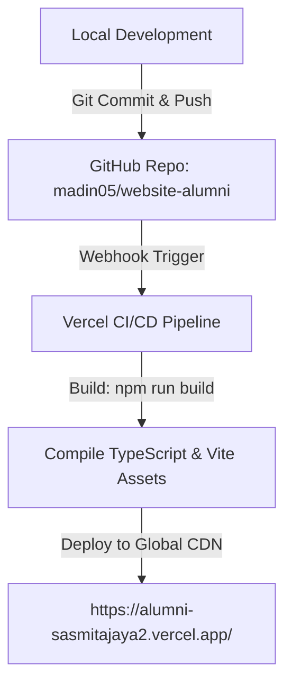

# 🚀 Panduan Deployment ke Vercel – Website Tracer Study Alumni SMK Sasmita Jaya 2

Dokumen ini menjelaskan konfigurasi, arsitektur, dan alur langkah-demi-langkah (deployment flow) untuk mempublikasikan website **Tracer Study Alumni SMK Sasmita Jaya 2** ke platform **Vercel** dengan domain target:

🔗 **Target URL:** [https://alumni-sasmitajaya2.vercel.app/](https://alumni-sasmitajaya2.vercel.app/)

---

## 📋 Ringkasan Konfigurasi Proyek

| Parameter | Nilai Konfigurasi | Keterangan |
| :--- | :--- | :--- |
| **Project Name** | `alumni-sasmitajaya2` | Menentukan subdomain otomatis `.vercel.app` |
| **Framework Preset** | `Vite` | Terdeteksi otomatis oleh Vercel |
| **Root Directory** | `./` | Root folder proyek |
| **Build Command** | `npm run build` *(atau `tsc && vite build`)* | Menghasilkan bundel teroptimasi |
| **Output Directory** | `dist` | Folder artefak HTML/CSS/JS statis |
| **Install Command** | `npm install` | Instalasi dependensi |
| **Node.js Version** | `18.x` atau `20.x` | Didukung penuh |

---

## 🛠️ File Konfigurasi SPA Routing (`vercel.json`)

Karena aplikasi ini dibangun menggunakan **React Router (SPA - Single Page Application)** dengan rute seperti `/dashboard`, `/tracer-study`, `/login`, dan `/berita/:id`, file [`vercel.json`](file:///c:/Arif/projek%20coding/web_alumni/vercel.json) telah dibuat pada root proyek untuk mencegah error **404 Not Found** saat halaman di-refresh langsung oleh pengguna:

```json
{
  "rewrites": [
    {
      "source": "/(.*)",
      "destination": "/index.html"
    }
  ]
}
```

> **Fungsi:** Mengarahkan seluruh permintaan URL ke `index.html` sehingga React Router dapat menangani routing di sisi browser (client-side routing) secara mulus.

---

## 🔄 Alur Deployment (Deployment Flow)

Ada 2 metode deployment yang bisa digunakan. **Metode 1 (GitHub Integration)** adalah metode yang paling direkomendasikan karena terintegrasi dengan CI/CD otomatis.



---

### 🌟 METODE 1: Deployment Otomatis via GitHub (Sangat Direkomendasikan)

Metode ini memberikan keuntungan **Auto-Deploy**: setiap kali ada commit/push baru ke branch GitHub, Vercel akan otomatis melakukan build dan update website tanpa perlu upload manual.

#### Langkah 1: Push Perubahan Terbaru ke GitHub
Jalankan perintah berikut di terminal:
```bash
git add .
git commit -m "feat(deploy): setup vercel config and prepare production build"
git push origin staging
```
*(Atau lakukan merge/push ke branch `main` jika ingin deploy langsung sebagai branch produksi).*

#### Langkah 2: Hubungkan Repositori di Vercel Dashboard
1. Buka browser dan login ke [https://vercel.com](https://vercel.com) (gunakan akun GitHub).
2. Klik tombol **"Add New..."** lalu pilih **"Project"**.
3. Di daftar *Import Git Repository*, pilih repositori `madin05/website-alumni`.
4. Klik **"Import"**.

#### Langkah 3: Konfigurasi Nama Project & Domain
1. Pada bagian **Project Name**, ubah nilainya menjadi:
   ```text
   alumni-sasmitajaya2
   ```
   *(Nama ini akan otomatis menghasilkan domain `alumni-sasmitajaya2.vercel.app`)*.
2. Pastikan **Framework Preset** terisi `Vite`.
3. Biarkan **Root Directory** tetap `./`.
4. Periksa **Build and Output Settings** (default sudah sesuai):
   - **Build Command:** `npm run build`
   - **Output Directory:** `dist`
5. Jika ada Environment Variable tambahan, tambahkan pada bagian **Environment Variables** (opsional untuk versi mock saat ini).

#### Langkah 4: Klik Deploy
1. Klik tombol **"Deploy"**.
2. Tunggu proses build selama ~30-60 detik.
3. Setelah selesai, website Anda langsung aktif dan dapat diakses publik di:
   👉 **[https://alumni-sasmitajaya2.vercel.app/](https://alumni-sasmitajaya2.vercel.app/)**

---

### 💻 METODE 2: Deployment Langsung via Vercel CLI (Terminal)

Jika ingin melakukan deploy langsung dari terminal tanpa melalui web dashboard:

#### Langkah 1: Login ke Akun Vercel
Jalankan perintah berikut di terminal:
```bash
npx vercel login
```
*Pilih login via GitHub atau Email, lalu konfirmasi tautan verifikasi yang masuk ke browser/email Anda.*

#### Langkah 2: Hubungkan dan Deploy ke Production
Jalankan perintah:
```bash
npx vercel --prod
```

Ikuti prompt interaktif di terminal:
1. `Set up and deploy "c:\Arif\projek coding\web_alumni"?` ➔ Ketik **`y`** (Yes)
2. `Which scope do you want to deploy to?` ➔ Pilih akun/tim Vercel Anda
3. `Link to existing project?` ➔ Ketik **`n`** (No)
4. `What's your project's name?` ➔ Ketik **`alumni-sasmitajaya2`**
5. `In which directory is your code located?` ➔ Tekan **`Enter`** (pilih `./`)
6. `Want to modify these settings?` ➔ Ketik **`n`** (No, pengaturan default Vite sudah sempurna)

Vercel akan meng-upload file, menjalankan `npm run build`, dan memberikan link live:
👉 `https://alumni-sasmitajaya2.vercel.app`

---

## 🌐 Pengaturan Custom Domain Tambahan (Opsional)

Jika nanti pihak sekolah SMK Sasmita Jaya 2 ingin menggunakan domain resmi sekolah (contoh: `alumni.smksasmitajaya2.sch.id`):

1. Masuk ke Dashboard Vercel ➔ Pilih project **`alumni-sasmitajaya2`**.
2. Klik tab **Settings** ➔ pilih menu **Domains**.
3. Masukkan nama domain (misal: `alumni.smksasmitajaya2.sch.id`) lalu klik **Add**.
4. Vercel akan memberikan catatan DNS (DNS Records) berupa:
   - **Type:** `CNAME`
   - **Name:** `alumni`
   - **Value:** `cname.vercel-dns.com`
5. Masukkan konfigurasi CNAME tersebut di panel pengelolaan DNS domain sekolah. Sertifikat SSL/HTTPS akan otomatis diterbitkan oleh Vercel secara gratis.

---

## 🔍 Checklist Verifikasi Pasca Deploy

Setelah deployment selesai, lakukan pengujian berikut pada browser desktop & HP:

- [x] **Beranda (Landing Page):** Buka `https://alumni-sasmitajaya2.vercel.app/` dan periksa tampilan hero, navbar, logo, berita, dan footer.
- [x] **Direct Link / Reload Test:** Buka halaman `https://alumni-sasmitajaya2.vercel.app/login` atau `https://alumni-sasmitajaya2.vercel.app/dashboard`, lalu tekan Refresh (F5). Halaman harus tetap terbuka tanpa error 404 berkat [`vercel.json`](file:///c:/Arif/projek%20coding/web_alumni/vercel.json).
- [x] **Mobile Responsiveness:** Uji akses melalui browser HP (Chrome/Safari) untuk memastikan font ukuran pas, padding proporsional, dan ikon presisi.
- [x] **Form Wizard Tracer:** Uji pengisian form tracer study 4 langkah.
- [x] **Pencarian Alumni & Loker:** Uji fitur filter jurusan, tahun lulus, dan pencarian lowongan kerja.
- [x] **Cek Status Ijazah:** Uji pencarian NISN di tab Cek Ijazah.
