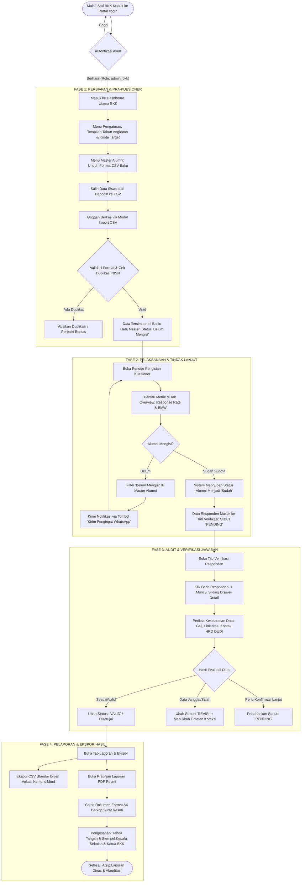
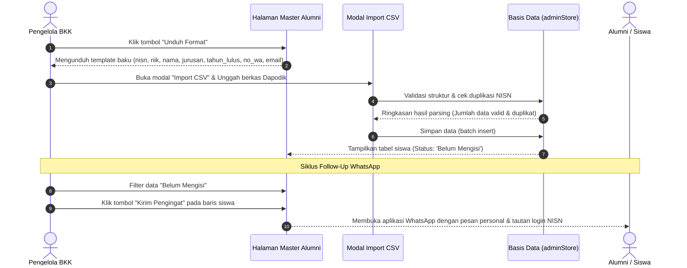
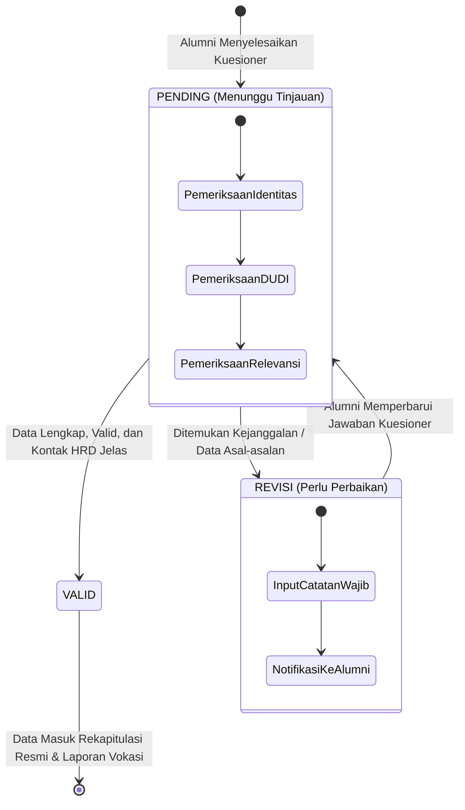
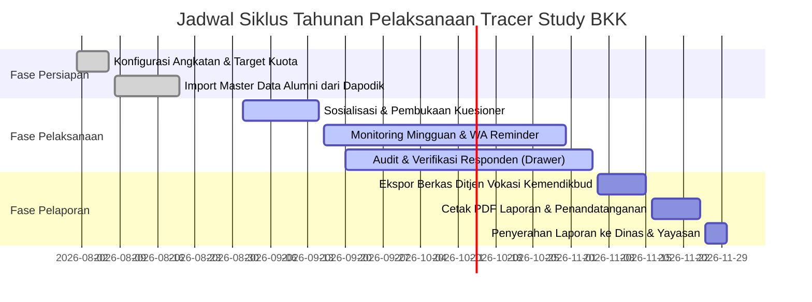

# DOKUMENTASI ALUR KERJA (WORKFLOW) END-TO-END
## Panel Administrator Bursa Kerja Khusus (BKK) & Tracer Study
### SMK Sasmita Jaya 2 Pamulang

---

## DAFTAR ISI
1. [Pendahuluan dan Latar Belakang](#1-pendahuluan-dan-latar-belakang)
2. [Peta Alur Kerja Utama (Global End-to-End Workflow)](#2-peta-alur-kerja-utama-global-end-to-end-workflow)
3. [Alur Operasional Per Modul](#3-alur-operasional-per-modul)
   - [3.1 Modul Ringkasan & Pemantauan (Overview Tab)](#31-modul-ringkasan--pemantauan-overview-tab)
   - [3.2 Modul Master Data Siswa Lulusan (Master Alumni Tab)](#32-modul-master-data-siswa-lulusan-master-alumni-tab)
   - [3.3 Modul Verifikasi & Audit Responden (Respondents Tab & Drawer)](#33-modul-verifikasi--audit-responden-respondents-tab--drawer)
   - [3.4 Modul Pesan Masuk & Pusat Bantuan (Messages Tab)](#34-modul-pesan-masuk--pusat-bantuan-messages-tab)
   - [3.5 Modul Publikasi Berita & Artikel BKK (News Tab)](#35-modul-publikasi-berita--artikel-bkk-news-tab)
   - [3.6 Modul Bursa Lowongan Kerja & Magang (Jobs Tab)](#36-modul-bursa-lowongan-kerja--magang-jobs-tab)
   - [3.7 Modul Pelaporan, Ekspor Data & Cetak PDF Resmi (Export & Report Tab)](#37-modul-pelaporan-ekspor-data--cetak-pdf-resmi-export--report-tab)
   - [3.8 Modul Pengaturan Parameter Sistem (Settings Tab)](#38-modul-pengaturan-parameter-sistem-settings-tab)
4. [Prosedur Operasional Standar (SOP) Tahunan Pengelola BKK](#4-prosedur-operasional-standar-sop-tahunan-pengelola-bkk)
5. [Matriks Hak Akses dan Penanganan Masalah (Troubleshooting)](#5-matriks-hak-akses-dan-penanganan-masalah-troubleshooting)

---

## 1. Pendahuluan dan Latar Belakang

Panel Administrator Bursa Kerja Khusus (BKK) SMK Sasmita Jaya 2 Pamulang merupakan subsistem manajemen terpusat yang dirancang untuk mengelola keseluruhan siklus penelusuran tamatan (*Tracer Study*), pemantauan keterserapan lulusan pada dunia kerja, wirausaha, maupun pendidikan tinggi (BMW: Bekerja, Melanjutkan Pendidikan, Wirausaha), serta tata kelola informasi karir sekolah.

Tujuan utama dari sistem ini adalah:
1. **Otomatisasi Pendataan**: Menggantikan pencatatan manual berbasis kertas dengan pengunggahan data induk (*batch pre-population*) terintegrasi Dapodik.
2. **Validasi Data Berkualitas**: Memastikan keabsahan data alumni sebelum diolah menjadi laporan akreditasi sekolah dan sinkronisasi ke Direktorat Jenderal Pendidikan Vokasi Kemendikbudristek RI.
3. **Peningkatan Angka Partisipasi (*Response Rate*)**: Menyediakan instrumen tindak lanjut (*follow-up*) langsung melalui integrasi pesan instan WhatsApp bagi alumni yang belum mengisi kuesioner.
4. **Legitimasi Pelaporan Formal**: Menyediakan modul pencetakan dokumen fisik berformat Kop Surat Resmi berstandar tata naskah dinas dengan pengesahan Kepala Sekolah dan Ketua BKK.

---

## 2. Peta Alur Kerja Utama (Global End-to-End Workflow)

Berikut adalah diagram alir (*flowchart*) siklus kerja end-to-end yang dijalankan oleh pengelola BKK:



---

## 3. Alur Operasional Per Modul

### 3.1 Modul Ringkasan & Pemantauan (Overview Tab)

Modul Ringkasan berfungsi sebagai pusat komando operasional pengelola BKK untuk membaca dinamika data secara instan.

```
┌──────────────────────────────────────────────────────────────────────────────────────────────────┐
│ PANEL MONITORING BKK SASMITA JAYA 2                                                              │
├──────────────────────┬──────────────────────┬──────────────────────┬─────────────────────────────┤
│ 🎯 Target Kuota      │ 📈 Response Rate     │ ⏳ Menunggu Verifikasi│ 💼 Keterserapan BMW         │
│    380 / 450 Siswa   │    84.4% Tercapai    │    12 Responden      │    Kerja: 65% | Kuliah: 20% │
└──────────────────────┴──────────────────────┴──────────────────────┴─────────────────────────────┘
```

#### Komponen Utama:
1. **Kartu Metrik Kunci (*Key Performance Indicators*)**:
   - **Target Kuota Lulusan**: Menampilkan rasio realisasi terhadap target (contoh: 380 dari 450 siswa).
   - **Tingkat Partisipasi (*Response Rate*)**: Menampilkan persentase keberhasilan pengumpulan kuesioner dengan visualisasi bilah kemajuan (*progress bar*).
   - **Antrean Verifikasi**: Menampilkan jumlah isian kuesioner yang berstatus `PENDING` dan membutuhkan audit data.
   - **Distribusi Keterserapan BMW**: Menghitung secara otomatis persentase lulusan yang Bekerja, Melanjutkan Pendidikan, Berwirausaha, maupun yang Masih Mencari Kerja.
2. **Grafik Partisipasi 6 Program Keahlian**:
   - Teknik Komputer dan Jaringan (TKJ)
   - Teknik Pemesinan (TPM)
   - Teknik Instalasi Tenaga Listrik (TITL)
   - Teknik Elektronika Industri (TEI)
   - Teknik Kendaraan Ringan Otomotif (TKRO)
   - Teknik dan Bisnis Sepeda Motor (TBSM)
3. **Pintasan Cepat (*Quick Actions*)**:
   - Tautan langsung menuju data kuesioner terbaru yang belum diverifikasi.

---

### 3.2 Modul Master Data Siswa Lulusan (Master Alumni Tab)

Modul ini digunakan untuk memuat data induk alumni yang berhak mengisi kuesioner Tracer Study. Data ini menjadi filter utama agar pihak luar yang tidak terdaftar tidak dapat merusak validitas data kuesioner.



#### Aturan dan Tata Cara Operasional:
1. **Struktur Berkas CSV Baku**:
   ```csv
   nisn,nik,nama,jurusan,tahun_lulus,no_wa,email
   0051234567,3674012345670001,Ahmad Dani,Teknik Komputer dan Jaringan,2024,081298765432,ahmaddani@example.com
   0052345678,3674012345670002,Budi Santoso,Teknik Pemesinan,2024,081311223344,budisantoso@example.com
   ```
2. **Pencarian dan Penyaringan**:
   - Pencarian cerdas berdasarkan Nama Siswa, NISN (10 digit), atau NIK (16 digit).
   - Penyaringan berdasarkan Program Keahlian dan Status Pengisian (*Sudah Mengisi* vs *Belum Mengisi*).
   - Pengurutan data alfabetis (A–Z / Z–A).
3. **Paginasi Terpadu**:
   - Ditampilkan 15 baris per halaman secara otomatis jika data lebih dari 15 siswa untuk menjaga kenyamanan navigasi.

---

### 3.3 Modul Verifikasi & Audit Responden (Respondents Tab & Drawer)

Modul ini merupakan inti pengawasan kualitas data (*data quality assurance*). Setiap kuesioner yang dikirimkan alumni wajib melalui proses kurasi sebelum disahkan menjadi data akreditasi sekolah.



#### Prosedur Audit pada Lembar Samping (*Sliding Drawer*):
1. **Pemeriksaan Bagian 1 — Identitas Pribadi**:
   - Memastikan NISN, NIK, alamat email aktif, dan nomor WhatsApp valid.
2. **Pemeriksaan Bagian 2 — Aktivitas Utama (BMW)**:
   - **Bekerja**: Memeriksa nama perusahaan DUDI mitra, posisi/jabatan kerja, rentang penghasilan bulanan, linieritas keahlian kejuruan, dan **Nama serta Nomor Kontak Atasan/HRD** (digunakan untuk survei kepuasan DUDI mitra).
   - **Melanjutkan Pendidikan**: Memeriksa nama perguruan tinggi, jenjang studi (D3/D4/S1), dan kesesuaian program studi.
   - **Wirausaha**: Memeriksa legalitas usaha, bidang usaha, dan rata-rata omzet bulanan.
   - **Mencari Kerja**: Memeriksa kendala utama yang dihadapi lulusan.
3. **Pemeriksaan Bagian 3 — Evaluasi Kurikulum Sekolah**:
   - Memeriksa skor kepuasan pembelajaran (bintang 1–5), saran penyempurnaan fasilitas bengkel/lab, dan masukan layanan BKK.
4. **Keputusan Verifikasi**:
   - **Disetujui (`VALID`)**: Data dianggap sah dan langsung masuk ke kalkulasi laporan resmi.
   - **Perlu Perbaikan (`REVISI`)**: Admin **wajib** mengisi formulir catatan revisi (contoh: *"Nomor telepon HRD kurang lengkap, mohon perbaiki"*).
   - **Tunda (`PENDING`)**: Menyimpan status peninjauan untuk dilanjutkan kemudian.

---

### 3.4 Modul Pesan Masuk & Pusat Bantuan (Messages Tab)

Modul Pesan Masuk berfungsi sebagai meja bantuan (*helpdesk*) internal untuk menampung pertanyaan, pengaduan kendala login NISN, maupun permohonan pembaruan data dari alumni.

```
┌──────────────────────────────────────────────────────────────────────────────────────────────────┐
│ KOTAK MASUK & PENGADUAN ALUMNI                                                                   │
├──────────────────────────────────────────┬───────────────────────────────────────────────────────┤
│ DAFTAR PESAN                             │ RINCIAN & TINDAK LANJUT                               │
│ • [BELUM DIBACA] Ahmad Dani (TKJ)        │ Pengirim: Ahmad Dani <ahmaddani@example.com>          │
│   Kendala NISN tidak ditemukan saat login│ No. WhatsApp: 081298765432                            │
│                                          │ Subjek: Kendala NISN saat Login                       │
│ • [TINDAK LANJUT] Siti Rahma (TPM)       │ Status: [ Belum Dibaca | Tindak Lanjut | Selesai ]    │
│   Konfirmasi perubahan tempat kerja baru │                                                       │
│                                          │ [ Balas via WhatsApp ]  [ Balas via Email ]  [ Hapus ]│
└──────────────────────────────────────────┴───────────────────────────────────────────────────────┘
```

#### Alur Penanganan Pesan:
1. Pesan masuk ditandai dengan badge notifikasi merah pada header dan navigasi samping.
2. Pengelola memilih pesan pada daftar kiri (pesan aktif ditandai garis aksen `#0d2346` di sebelah kiri).
3. Pengelola membaca isi pesan dan memilih salah satu tindakan:
   - Mengubah status tiket (*Belum Dibaca* $\rightarrow$ *Tindak Lanjut* $\rightarrow$ *Selesai*).
   - Menghubungi pengirim secara langsung melalui tombol **Balas via WhatsApp** atau **Balas via Email**.
   - Menghapus pesan yang telah selesai ditangani dengan konfirmasi modal aman.

---

### 3.5 Modul Publikasi Berita & Artikel BKK (News Tab)

Modul ini digunakan untuk mempublikasikan artikel informasi karir, tips wawancara kerja, pengumuman rekrutmen bersama, agenda sertifikasi BNSP, dan kisah sukses alumni ke halaman depan (*Landing Page*).

#### Alur Kerja Pembuatan Berita:
1. **Navigasi Halaman**:
   - Klik tombol **"Buat Berita Baru"** di sudut kanan atas daftar berita untuk beralih ke formulir editor penuh.
2. **Pengisian Formulir**:
   - **Judul Berita**: Judul informatif dan representatif.
   - **Kategori Berita**: Memilih kategori via dropdown kustom (*BKK & Karir*, *Tracer Study*, *Kemitraan DUDI*, *Fasilitas*, *Panduan Karir*, *Sertifikasi*, *Prestasi Alumni*).
   - **Penulis & Waktu Baca**: Identitas redaksi (contoh: *Tim Humas BKK*) dan perkiraan durasi baca (contoh: *3 min read*).
   - **Unggah Sampul Berita**: Mendukung unggah berkas gambar lokal dari komputer atau memasukkan URL gambar web langsung disertai opsi pustaka gambar contoh (*presets*).
   - **Ringkasan (*Excerpt*)**: Cuplikan 1–2 kalimat yang menarik untuk kartu tampilan muka.
   - **Isi Berita Lengkap**: Naskah berita terstruktur.
3. **Penerbitan (*Publish*)**:
   - Klik tombol **"Publikasikan Berita"**. Berita langsung tersinkronisasi dan tampil pada halaman utama publik.

---

### 3.6 Modul Bursa Lowongan Kerja & Magang (Jobs Tab)

Modul ini mengelola pangkalan data lowongan pekerjaan (*job vacancy*) dan kesempatan magang industri yang terafiliasi dengan jaringan kemitraan DUDI SMK Sasmita Jaya 2.

```mermaid
flowchart LR
    A[Pengelola BKK] --> B[Klik 'Tambah Lowongan Baru']
    B --> C[Isi Data: Posisi, Perusahaan, Kota, Gaji, Deadline]
    C --> D[Pilih Tipe: Full-time / Magang / Kontrak / Part-time]
    D --> E[Centang Sasaran Multi-Jurusan: TKJ / TPM / TITL / dll]
    E --> F[Pilih Status Mitra: Terverifikasi DUDI BKK]
    F --> G[Tulis Deskripsi & Rincian Persyaratan Kerja]
    G --> H[Simpan Lowongan]
    H --> I[Lowongan Tayang di Tab Loker Dashboard Alumni]
```



#### Fitur Khusus:
- **Badge Mitra Resmi BKK**: Menandai lowongan yang berasal dari DUDI mitra sekolah terpercaya.
- **Sasaran Multi-Jurusan**: Memungkinkan satu lowongan dialokasikan untuk beberapa program keahlian sekaligus.
- **Paginasi Daftar Lowongan**: Menampilkan 6 kartu lowongan per halaman dengan tata letak grid rapi.

---

### 3.7 Modul Pelaporan, Ekspor Data & Cetak PDF Resmi (Export & Report Tab)

Modul Pelaporan dirancang untuk mempermudah tugas birokrasi sekolah dalam menyusun laporan pertanggungjawaban program ke instansi pembina.

```
┌──────────────────────────────────────────────────────────────────────────────────────────────────┐
│ PUSAT LAPORAN & EKSPOR DATA                                                                     │
├──────────────────────────────────────────────────────────────────────────────────────────────────┤
│ 1. Berkas CSV Standar Ditjen Vokasi Kemendikbud RI (18 Kolom Lengkap)         [ Unduh CSV ]      │
│ 2. Master Data Seluruh Siswa Lulusan & Status Pengisian                       [ Unduh Master ]   │
│ 3. Matriks Rekapitulasi Keterserapan Lulusan Per Program Keahlian (BMW)       [ Unduh Matriks ]  │
│                                                                                                  │
│ 🖨️ CETAK LEMBAR PENGESAHAN LAPORAN PDF RESMI (KOP SURAT & TANDA TANGAN)      [ Buka Pratinjau ] │
└──────────────────────────────────────────────────────────────────────────────────────────────────┘
```

#### Spesifikasi Dokumen Cetak Fisik PDF:
1. **Kop Naskah Dinas Resmi**:
   - Logo resmi sekolah dan yayasan.
   - Identitas: *YAYASAN SASMITA JAYA — SMK SASMITA JAYA 2 PAMULANG*.
   - Status Akreditasi: **Terakreditasi "A"** | NPSN: **20614758**.
   - Garis pemisah ganda kop surat standar kearsipan dinas.
2. **Tabel Rekapitulasi Data**:
   - Matriks tabulasi per 6 program keahlian: Target Siswa, Respon Masuk, Bekerja, Kuliah, Wirausaha, Belum Bekerja, dan Persentase Respon.
3. **Kolom Tanda Tangan & Pengesahan**:
   - Kolom tanda tangan Kepala Sekolah (*Drs. H. Bakri Hadi, M.M.*) dan Ketua BKK (*Ahmad Fauzi, S.Pd., M.Kom.*).
   - Dioptimalkan khusus cetak printer ukuran kertas **A4** melalui aturan CSS `@media print`.

---

### 3.8 Modul Pengaturan Parameter Sistem (Settings Tab)

Modul ini memfasilitasi penyesuaian konfigurasi kelembagaan tanpa perlu mengubah kode program:
- **Penyesuaian Angkatan**: Mengatur tahun kelulusan aktif yang menjadi target penelusuran (contoh: *2024*).
- **Target Kuota**: Mengatur target jumlah responden yang harus dicapai (contoh: *450 siswa*).
- **Rentang Periode Pengisian**: Menentukan tanggal mulai dan batas akhir pelaksanaan survei.
- **Data Pejabat Penandatangan**: Mengubah nama dan NIP Kepala Sekolah serta Ketua BKK.
- **Pemulihan Data Demo (*Reset Database*)**: Opsi sekali-klik untuk mereset seluruh data simulasi kembali ke kondisi awal untuk keperluan pengujian sistem.

---

## 4. Prosedur Operasional Standar (SOP) Tahunan Pengelola BKK



### Tahap I: Pra-Pelaksanaan (Bulan Agustus)
1. Buka menu **Pengaturan BKK**, masukkan tahun kelulusan yang disurvei (misal: `2024`) dan target kuota siswa.
2. Unduh template CSV dari menu **Master Alumni**.
3. Buka berkas dengan Microsoft Excel / Google Sheets, masukkan data dari buku induk siswa / Dapodik, lalu simpan kembali sebagai berkas `.csv`.
4. Unggah berkas melalui modal **Import CSV**. Pastikan status seluruh siswa terdaftar sebagai `Belum Mengisi`.

### Tahap II: Pelaksanaan Survei & Tindak Lanjut (Bulan September – Oktober)
1. Pantau metrik capaian di tab **Overview** minimal 2 kali dalam sepekan.
2. Setiap hari Senin, buka menu **Master Alumni**, aktifkan filter **"Belum Mengisi"**, dan klik tombol **"Kirim Pengingat"** secara berkala kepada alumni yang belum mengisi.
3. Buka menu **Verifikasi Responden**, lakukan kurasi kuesioner yang masuk, periksa kontak atasan DUDI, dan berikan status `VALID` atau `REVISI`.

### Tahap III: Pasca-Pelaksanaan & Pelaporan (Bulan November)
1. Pastikan seluruh responden berstatus `VALID`.
2. Buka menu **Laporan & Ekspor**:
   - Unduh berkas **CSV Standar Ditjen Vokasi** untuk arsip digital dan sinkronisasi pusat.
   - Buka menu **Pratinjau Laporan PDF**, gunakan menu cetak peramban (*browser print*) dengan tujuan *Save as PDF* atau langsung ke printer kertas A4.
3. Bawa dokumen fisik kepada Kepala Sekolah dan Ketua BKK untuk ditandatangani dan dicap stempel dinas sekolah.
4. Serahkan salinan laporan ke Yayasan Sasmita Jaya dan Pengawas SMK Dinas Pendidikan.

---

## 5. Matriks Hak Akses dan Penanganan Masalah (Troubleshooting)

| Masalah yang Sering Dihadapi | Kemungkinan Penyebab | Solusi Pengelola BKK |
| :--- | :--- | :--- |
| Alumni tidak dapat masuk ke sistem dengan NISN-nya | NISN siswa belum terdaftar di Master Data Alumni | Buka menu **Master Alumni** $\rightarrow$ klik **Tambah Siswa** $\rightarrow$ masukkan NISN, NIK, Nama, Jurusan, dan No. WA siswa secara manual. |
| Tombol WhatsApp Reminder tidak membuka chat | Format nomor telepon salah (menggunakan awalan 0 atau karakter spasi) | Sistem secara otomatis mengonversi awalan `08xx` menjadi format internasional `628xx`. Pastikan nomor yang dimasukkan valid. |
| Angka persentase Response Rate tidak bertambah setelah siswa mengisi | Isian kuesioner belum tersinkronisasi atau peramban dalam mode luring (*offline*) | Minta siswa memuat ulang halaman kuesioner dan pastikan muncul layar konfirmasi *"Kuesioner Berhasil Dikirim"*. Periksa tab **Verifikasi**. |
| Tampilan cetak PDF terpotong atau memuat elemen menu web | Pengaturan dialog print peramban belum disesuaikan | Pada menu dialog print browser: Pilih orientasi **Portrait**, ukuran kertas **A4**, margin **Default**, dan pastikan opsi **Background graphics** dicentang. |

---
*Dokumen ini diterbitkan sebagai panduan operasional resmi Bursa Kerja Khusus (BKK) SMK Sasmita Jaya 2 Pamulang.*
