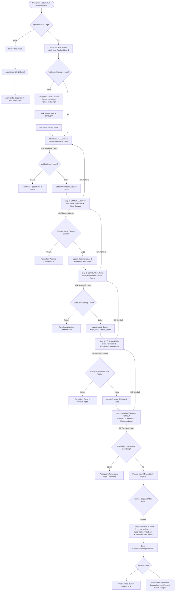
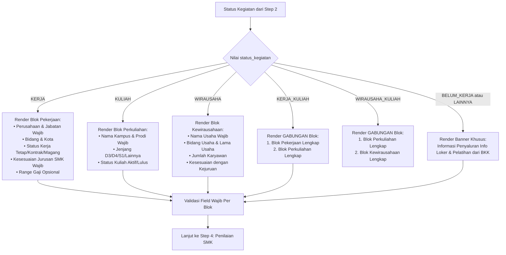
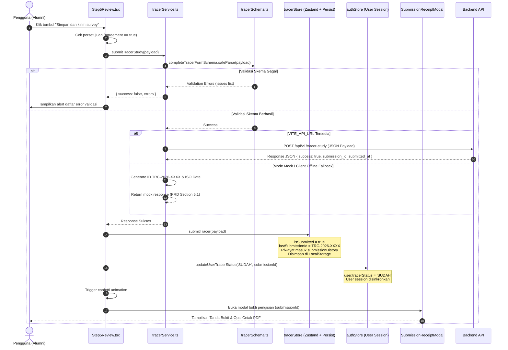

# Workflow & Dokumentasi Teknis: Modul Tracer Study
## Sistem Informasi Alumni & Tracer Study SMK Sasmita Jaya 2

Dokumen ini menjelaskan secara rinci dan aktual seluruh alur kerja (*workflow*), arsitektur komponen, validasi data, logika percabangan kondisional, serta diagram alir (*flowchart*) dari modul **Tracer Study** yang telah diimplementasikan pada kode sumber aplikasi.

---

## 1. Ringkasan Eksekutif & Struktur Berkas

Modul Tracer Study dirancang khusus untuk merekam jejak lulusan SMK Sasmita Jaya 2 sesuai instrumen penelusuran lulusan Direktorat SMK Kemendikdasmen RI dengan gaya antarmuka formal **Dapodik Alumni**. 

### 1.1 Berkas Sumber Kode Terkait
| Modul / Komponen | Path Berkas | Fungsi Utama |
| :--- | :--- | :--- |
| **Routing & Guard** | [`src/App.tsx`](file:///c:/Arif/projek%20coding/web_alumni/src/App.tsx) | Rute `/tracer-study` dan proteksi autentikasi |
| **Tipe Data (Types)** | [`src/types/tracer.ts`](file:///c:/Arif/projek%20coding/web_alumni/src/types/tracer.ts) | Definisi interface TypeScript & payload kuesioner |
| **Skema Validasi** | [`src/schemas/tracerSchema.ts`](file:///c:/Arif/projek%20coding/web_alumni/src/schemas/tracerSchema.ts) | Aturan validasi Zod untuk setiap langkah form |
| **State Management** | [`src/store/tracerStore.ts`](file:///c:/Arif/projek%20coding/web_alumni/src/store/tracerStore.ts) | Store Zustand dengan middleware `persist` (Local Storage) |
| **Sinkronisasi Sesi** | [`src/store/authStore.ts`](file:///c:/Arif/projek%20coding/web_alumni/src/store/authStore.ts) | Update status tracer user (`SUDAH` / `BELUM`) |
| **API Client Service** | [`src/services/tracerService.ts`](file:///c:/Arif/projek%20coding/web_alumni/src/services/tracerService.ts) | Pengiriman data ke endpoint `/api/v1/tracer-study` |
| **Main Orchestrator** | [`src/components/tracer/TracerWizard.tsx`](file:///c:/Arif/projek%20coding/web_alumni/src/components/tracer/TracerWizard.tsx) | Wrapper multi-step form & modal pengendali |
| **Pengantar Survei** | [`src/components/tracer/TracerIntro.tsx`](file:///c:/Arif/projek%20coding/web_alumni/src/components/tracer/TracerIntro.tsx) | Halaman pembuka & petunjuk instrumen resmi |
| **Step 1: Identitas** | [`src/components/tracer/Step1Identity.tsx`](file:///c:/Arif/projek%20coding/web_alumni/src/components/tracer/Step1Identity.tsx) | Form data pribadi alumni & validasi tahun |
| **Step 2: Status** | [`src/components/tracer/Step2Status.tsx`](file:///c:/Arif/projek%20coding/web_alumni/src/components/tracer/Step2Status.tsx) | Pilihan 7 aktivitas utama & masa tunggu |
| **Step 3: Detail** | [`src/components/tracer/Step3Details.tsx`](file:///c:/Arif/projek%20coding/web_alumni/src/components/tracer/Step3Details.tsx) | Form kondisional dinamis (Kerja/Kuliah/Usaha) |
| **Step 4: Evaluasi** | [`src/components/tracer/Step4Evaluation.tsx`](file:///c:/Arif/projek%20coding/web_alumni/src/components/tracer/Step4Evaluation.tsx) | Penilaian relevansi kurikulum & kompetensi |
| **Step 5: Review** | [`src/components/tracer/Step5Review.tsx`](file:///c:/Arif/projek%20coding/web_alumni/src/components/tracer/Step5Review.tsx) | Umpan balik BKK, persetujuan & eksekusi submit |
| **Bukti Pengisian** | [`src/components/tracer/SubmissionReceiptModal.tsx`](file:///c:/Arif/projek%20coding/web_alumni/src/components/tracer/SubmissionReceiptModal.tsx) | Modal tanda bukti resmi & cetak/PDF |

---

## 2. Diagram Alir (Flowcharts)

### 2.1 Flowchart Alur Navigasi & Siklus Hidup Pengguna (User Journey)
Diagram berikut menggambarkan perjalanan alumni mulai dari mengakses tautan hingga mendapatkan tanda bukti registrasi:



---

### 2.2 Flowchart Percabangan Logika Kondisional (Step 3: Detail Aktivitas)
Di **Langkah 3**, sistem memeriksa nilai `status_kegiatan` dari `Step 2` dan merender form secara dinamis:



---

### 2.3 Flowchart Submit & Sinkronisasi Data (Submission & Storage Flow)
Diagram berikut merinci bagaimana data divalidasi dengan Zod, disimpan ke REST API/klien, dan disinkronkan ke seluruh sistem:



---

## 3. Rincian Teknis Setiap Tahap Workflow

### 3.1 Gerbang Autentikasi & Masuk Wizard
* **Lokasi Kode**: [`src/App.tsx:40-43`](file:///c:/Arif/projek%20coding/web_alumni/src/App.tsx#L40-L43) dan [`src/components/tracer/TracerWizard.tsx:33-37`](file:///c:/Arif/projek%20coding/web_alumni/src/components/tracer/TracerWizard.tsx#L33-L37)
* **Aturan**:
  1. Halaman Tracer Study hanya dapat diakses oleh user yang telah terautentikasi (`isAuthenticated === true`).
  2. Jika pengunjung tamu (belum login) mengakses `/tracer-study`, sistem secara otomatis me-redirect ke `/login`.
  3. Dapat diakses langsung dari menu navigasi utama, tautan cepat di beranda, tombol kartu di detail berita, maupun tab **Tracer Study** di dalam Dashboard Alumni.

---

### 3.2 Tampilan Pengantar (*Intro Screen*)
* **Lokasi Kode**: [`src/components/tracer/TracerIntro.tsx`](file:///c:/Arif/projek%20coding/web_alumni/src/components/tracer/TracerIntro.tsx)
* **Kondisi Muncul**: Saat `hasStartedSurvey === false` pada `useTracerStore`.
* **Elemen yang Ditampilkan**:
  1. Header resmi: *"Pengantar bagi Alumni SMK"*.
  2. 5 Poin Tujuan Tracer Study Kemendikdasmen (keterserapan lulusan, evaluasi mutu, informasi ketenagakerjaan, pemetaan kompetensi, dan akreditasi sekolah).
  3. 3 Butir Petunjuk Pengisian instrumen.
  4. Tombol aksi: `MULAI SURVEY` (mengubah `hasStartedSurvey` menjadi `true` dan scroll ke atas).

---

### 3.3 Step 1: Identitas / Data Pribadi Alumni
* **Lokasi Kode**: [`src/components/tracer/Step1Identity.tsx`](file:///c:/Arif/projek%20coding/web_alumni/src/components/tracer/Step1Identity.tsx)
* **Skema Validasi**: `step1Schema` pada [`src/schemas/tracerSchema.ts:138-185`](file:///c:/Arif/projek%20coding/web_alumni/src/schemas/tracerSchema.ts#L138-L185)
* **Atribut & Validasi**:
  * `nama_lengkap`: Wajib, minimal 3 karakter, maksimal 100 karakter.
  * `nisn`: Wajib, minimal 4 digit string.
  * `nik`: Opsional, maksimal 16 digit angka (sesuai data Dukcapil).
  * `tahun_masuk`: Wajib, angka tahun minimal 2000 s.d. tahun berjalan.
  * `tahun_lulus`: Wajib, angka tahun minimal 2003 s.d. tahun berjalan + 1.
  * *Refinement Rule*: `tahun_lulus >= tahun_masuk` (mencegah inkonsistensi waktu kelulusan).
  * `jurusan`: Wajib, enum 7 kompetensi keahlian resmi SMK Sasmita Jaya 2:
    - *Teknik Komputer dan Jaringan*
    - *Rekayasa Perangkat Lunak*
    - *Teknik Kendaraan Ringan Otomotif*
    - *Teknik Bisnis Sepeda Motor*
    - *Otomatisasi & Tata Kelola Perkantoran*
    - *Akuntansi & Keuangan Lembaga*
    - *Bisnis Daring & Pemasaran*
  * `no_whatsapp`: Wajib, regex validasi format telepon Indonesia `/^(\+62|62|0)8[0-9]{7,11}$/`.
  * `email`: Wajib, format standar email RFC.
  * `jenis_kelamin`: Radio button (*Laki-laki* / *Perempuan*).
* **Fitur Tambahan**: Tombol **"Isi Contoh Data"** untuk pengujian cepat dengan data mock valid.

---

### 3.4 Step 2: Status Kegiatan & Masa Tunggu
* **Lokasi Kode**: [`src/components/tracer/Step2Status.tsx`](file:///c:/Arif/projek%20coding/web_alumni/src/components/tracer/Step2Status.tsx)
* **Pilihan Status (`status_kegiatan`)**:
  1. `KERJA` — Bekerja di instansi / perusahaan / kantor.
  2. `KULIAH` — Melanjutkan studi perguruan tinggi (D3, D4, S1).
  3. `WIRAUSAHA` — Membuka usaha mandiri / menjalankan bisnis.
  4. `KERJA_KULIAH` — Menjalani pekerjaan sekaligus studi perguruan tinggi.
  5. `WIRAUSAHA_KULIAH` — Menjalankan usaha sekaligus studi perguruan tinggi.
  6. `BELUM_KERJA` — Sedang mencari pekerjaan / masa persiapan.
  7. `LAINNYA` — Aktivitas di luar kategori di atas.
* **Pilihan Masa Tunggu (`masa_tunggu`)**:
  - `< 3 bulan`
  - `3–6 bulan`
  - `6–12 bulan`
  - `> 12 bulan`
  - `Belum mendapatkan pekerjaan`
* **Logika Inisialisasi Otomatis**:
  Saat alumni memilih atau mengubah status, action `updateStatusKegiatan` di Zustand secara otomatis menyiapkan template data child object (`detail_kerja`, `detail_kuliah`, `detail_usaha`) atau me-reset child yang tidak relevan menjadi `null`.

---

### 3.5 Step 3: Detail Aktivitas Kondisional
* **Lokasi Kode**: [`src/components/tracer/Step3Details.tsx`](file:///c:/Arif/projek%20coding/web_alumni/src/components/tracer/Step3Details.tsx)
* **Tampilan Dinamis Berdasarkan Status**:
  1. **Jika Ada Unsur Kerja (`KERJA` atau `KERJA_KULIAH`)**:
     * Nama Perusahaan/Instansi (*Wajib*)
     * Jabatan / Posisi Pekerjaan (*Wajib*)
     * Bidang Pekerjaan (*Opsional*)
     * Kota / Kabupaten Tempat Bekerja (*Opsional*)
     * Status Pekerjaan: Radio (*Tetap*, *Kontrak*, *Freelance*, *Magang*)
     * Kesesuaian Pekerjaan dengan Kejuruan SMK (*Wajib*): Radio (*Sangat sesuai*, *Sesuai*, *Kurang sesuai*, *Tidak sesuai*)
     * Kisaran Penghasilan Bulanan (*Opsional*): Radio (< Rp 2jt, Rp 2jt–4jt, Rp 4jt–7jt, > Rp 7jt)
  2. **Jika Ada Unsur Kuliah (`KULIAH`, `KERJA_KULIAH`, atau `WIRAUSAHA_KULIAH`)**:
     * Nama Perguruan Tinggi (*Wajib*)
     * Program Studi (*Wajib*)
     * Jenjang Pendidikan: Radio (*D3*, *D4*, *S1*, *Lainnya*)
     * Status Kuliah: Radio (*Aktif*, *Lulus*, *Tidak melanjutkan*)
  3. **Jika Ada Unsur Wirausaha (`WIRAUSAHA` atau `WIRAUSAHA_KULIAH`)**:
     * Nama Usaha yang Dijalankan (*Wajib*)
     * Bidang Usaha (*Opsional*)
     * Lama Menjalankan Usaha: Radio (< 6 bulan, 6–12 bulan, 1–2 tahun, > 2 tahun)
     * Jumlah Tenaga Kerja: Radio (*Dijalankan sendiri*, *1–3 orang*, *4–10 orang*, *> 10 orang*)
     * Keterkaitan Usaha dengan Kejuruan: Radio (*Sangat berkaitan*, *Berkaitan*, *Kurang berkaitan*, *Tidak berkaitan*)
  4. **Jika Belum Bekerja / Lainnya (`BELUM_KERJA` atau `LAINNYA`)**:
     * Menampilkan kotak informasi khusus: *"Data Anda akan digunakan oleh BKK SMK Sasmita Jaya 2 untuk menyalurkan informasi lowongan kerja aktif dan pelatihan kerja."*

---

### 3.6 Step 4: Penilaian Terhadap SMK & Evaluasi Kurikulum
* **Lokasi Kode**: [`src/components/tracer/Step4Evaluation.tsx`](file:///c:/Arif/projek%20coding/web_alumni/src/components/tracer/Step4Evaluation.tsx)
* **Komponen Evaluasi**:
  1. **Tingkat Relevansi Kompetensi**: Skala Likert 1 s.d. 5 (*1 - Sangat Tidak Relevan* s.d. *5 - Sangat Relevan*).
  2. **Kompetensi yang Paling Bermanfaat**: Pilihan multi-select checkbox (minimal wajib pilih 1):
     - *Kompetensi teknis*
     - *Komputer/TIK*
     - *Komunikasi*
     - *Kerja sama*
     - *Kedisiplinan*
     - *Kewirausahaan*
     - *Lainnya*
  3. **Kompetensi yang Masih Perlu Ditingkatkan**: Textarea terbuka (masukan alumni untuk lab/praktik).
  4. **Bantuan Pembelajaran Menghadapi Dunia Kerja**: Radio (*Sangat membantu*, *Membantu*, *Kurang membantu*, *Tidak membantu*).

---

### 3.7 Step 5: Masukan Alumni, Konfirmasi & Submit
* **Lokasi Kode**: [`src/components/tracer/Step5Review.tsx`](file:///c:/Arif/projek%20coding/web_alumni/src/components/tracer/Step5Review.tsx)
* **Elemen Form**:
  1. Textarea Saran Peningkatan Pembelajaran di SMK.
  2. Textarea Saran Layanan BKK & Hubungan Alumni.
  3. Textarea Saran Kerja Sama Industri & Guru Tamu.
  4. Pilihan Radio Kesediaan Dihubungi Kembali (*Ya* / *Tidak*).
  5. **Kartu Ringkasan Isian**: Menampilkan kilas balik Nama, NISN, Jurusan, dan Status Utama.
  6. **Pernyataan Kebenaran Data (Agreement)**: Checkbox wajib dicentang sebelum data dapat terkirim:
     > *"Saya menyatakan dengan sesungguhnya bahwa data yang saya isikan adalah benar dan sesuai dengan kondisi sebenarnya."*
* **Aksi Eksekusi Pengiriman**:
  - Memanggil `submitTracerStudy(payload)` dari [`src/services/tracerService.ts`](file:///c:/Arif/projek%20coding/web_alumni/src/services/tracerService.ts).
  - Melakukan validasi final payload lengkap via `completeTracerFormSchema.safeParse`.
  - Mengirim payload ke backend via HTTP POST ke `/api/v1/tracer-study` (atau simulasi jika backend belum aktif).
  - Mengupdate status akun alumni pada `authStore` menjadi `SUDAH`.
  - Memicu animasi perayaan confetti (`canvas-confetti`).
  - Membuka modal tanda bukti bukti pengisian.

---

### 3.8 Modal Tanda Bukti Resmi (*Submission Receipt*)
* **Lokasi Kode**: [`src/components/tracer/SubmissionReceiptModal.tsx`](file:///c:/Arif/projek%20coding/web_alumni/src/components/tracer/SubmissionReceiptModal.tsx)
* **Fitur Tanda Bukti**:
  1. Nomor Registrasi Unik Resmi (contoh format: `TRC-2026-8492`).
  2. Kop Surat Yayasan & Logo Resmi SMK Sasmita Jaya 2.
  3. Rincian Terdata: Nama Lengkap, NISN/NIK, Jurusan, Tahun Lulus, Status Terdata, Waktu Pengiriman (WIB).
  4. Badge verifikasi hijau: **TERVALIDASI**.
  5. Instruksi: *"Tunjukkan bukti ini di loket Tata Usaha / BKK untuk verifikasi pengambilan Ijazah & Sertifikat BNSP."*
  6. Tombol **"Cetak Bukti (Print / PDF)"**: Menggunakan print stylesheet khusus (`window.print()`).
  7. Tombol **"Buka Dashboard Alumni"**: Mengarahkan kembali pengguna ke beranda dashboard dengan status kuesioner yang telah terverifikasi selesai.

---

## 4. Struktur Kontrak Data (Payload JSON)

Berikut adalah struktur data JSON aktual yang dikirimkan ke server pada saat submit:

```json
{
  "identitas": {
    "nama_lengkap": "Ahmad Dani",
    "nisn": "0051234567",
    "nik": "3674012345670001",
    "tahun_masuk": 2021,
    "tahun_lulus": 2024,
    "jurusan": "Teknik Komputer dan Jaringan",
    "no_whatsapp": "081298765432",
    "email": "ahmaddani@example.com",
    "jenis_kelamin": "Laki-laki"
  },
  "status_kegiatan": "KERJA_KULIAH",
  "masa_tunggu": "< 3 bulan",
  "detail_kerja": {
    "nama_perusahaan": "PT Solusi Teknologi Nusantara",
    "jabatan": "Technical Support",
    "bidang_pekerjaan": "Teknologi Informasi & Jaringan",
    "kota_kabupaten": "Tangerang Selatan",
    "status_pekerjaan": "Tetap",
    "kesesuaian_jurusan": "Sangat sesuai",
    "kisaran_penghasilan": "Rp 4.000.000 – Rp 7.000.000"
  },
  "detail_kuliah": {
    "nama_kampus": "Universitas Pamulang",
    "program_studi": "Teknik Informatika",
    "jenjang": "S1",
    "status_kuliah": "Aktif"
  },
  "detail_usaha": null,
  "evaluasi": {
    "skor_relevansi": 5,
    "kompetensi_bermanfaat": [
      "Kompetensi teknis",
      "Komunikasi",
      "Kerja sama"
    ],
    "kompetensi_ditingkatkan": "Bahasa Inggris dan praktik cloud computing",
    "bantu_dunia_kerja": "Sangat membantu",
    "saran_pembelajaran": "Perbanyak jam praktik industri dan sertifikasi kejuruan.",
    "saran_bkk": "Perluas kemitraan rekrutmen kampus dan industri Jabodetabek.",
    "saran_industri": "Tingkatkan program guru tamu dari praktisi industri.",
    "kesediaan_dihubungi": true
  },
  "agreement": true
}
```

---
k
## 5. Fitur Keandalan Data & UX Tambahan

1. **Auto-Save & Pencegahan Kehilangan Data (*Draft Persistence*)**:
   - Store formulir diintegrasikan dengan middleware `persist` Zustand (`tracer_study_sasmita2_store` di LocalStorage).
   - Apabila halaman tidak sengaja di-refresh, koneksi putus, atau tab browser ditutup, alumni tidak akan kehilangan isian yang sudah diketik sebelumnya.
2. **Modal Reset Formulir**:
   - Terdapat tombol *"Reset Isian"* pada pojok kanan atas wizard yang dilindungi dialog konfirmasi ([`src/components/ui/ConfirmModal.tsx`](file:///c:/Arif/projek%20coding/web_alumni/src/components/ui/ConfirmModal.tsx)) untuk mengembalikan form ke status bersih jika diperlukan.
3. **Responsif Seluler & Tablet**:
   - Stepper secara otomatis berubah menjadi mode ringkas numerik pada layar HP (`sm:hidden`), dan mode tab horizontal Dapodik pada layar desktop/tablet.
4. **Integrasi Status Dashboard Real-time**:
   - Begitu submit berhasil, banner pada [`src/components/dashboard/OverviewTab.tsx`](file:///c:/Arif/projek%20coding/web_alumni/src/components/dashboard/OverviewTab.tsx) secara otomatis beralih dari ajakan kuesioner menjadi notifikasi sukses *"Data Tracer Study Anda Sudah Tersimpan"* dengan tombol cepat untuk mencetak ulang tanda bukti kapan saja.
